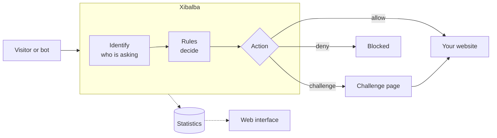

<p align="center">
  
</p>

<p align="center">
  <a href="docs/ROADMAP.md"></a>
  <a href="LICENSE"></a>
  
</p>

Xibalba is a self-hosted gate that sits in front of a website. It turns away AI
crawlers and abusive bots, lets wanted crawlers through, and shows the site
owner what it did.

It is built for organisations that need this to be dependable and presentable:
public authorities, universities and small firms. That means an accessible
challenge page, no tracking, no third-party requests, and one program you run
on your own server.

> [!IMPORTANT]
> Xibalba is in early development. Today it runs in front of a website and
> allows, blocks or challenges requests by rules you write. The maintained
> crawler lists and the web interface are being built. The table below says
> exactly what exists.

## What it will do



- **Treats crawlers by purpose.** Crawlers that collect training data are
  blocked by default. Crawlers that answer a person's question and link back
  to you are let through, like a search engine.
- **Checks identity, not just the name.** A crawler is trusted only if it comes
  from its operator's published addresses.
- **Challenges the rest.** Unidentified traffic gets a challenge that browsers
  pass and bulk scrapers find expensive. It works without JavaScript.
- **Your rules.** Ready-made presets for normal use, a full rule engine for
  experts, and block and allow lists for addresses and ranges.
- **Shows its work.** A web interface with what was allowed, challenged and
  denied, without storing visitors' IP addresses by default.

## Status

| Part | State |
|---|---|
| Configuration with line-accurate error messages | Built |
| Health reporting per component | Built |
| Start-up, shutdown and failure isolation | Built |
| Reverse proxy with websocket and streaming support | Built |
| Real client address behind trusted proxies, spoofed headers ignored | Built |
| Rule engine: user agent, path, host, method, header and address conditions, weights and thresholds | Built |
| Importable rule files, dry-run mode, decision counters | Built |
| Accessible block page in German and English | Built |
| Security check: proof of work, a path without JavaScript, signed pass cookie | Built |
| Contact line and default language of the visitor pages adjustable | Built |
| Own name and wording on the visitor pages, Xibalba line removable (sponsor license) | Built |
| Tested configurations for nginx, Caddy, Apache, HAProxy and Traefik | Built |
| Container image (Dockerfile), Compose example, systemd unit, Kubernetes example | Built; images not published yet |
| Logo and accent colour on visitor pages | Planned |
| Crawler classes, verified crawler identity (address lists, reverse DNS), presets | Built |
| Own crawler definitions | Built |
| Request limits per client with a list of exempt addresses | Built |
| Presets: check everything that says it is a browser; exceptions for feeds, git, robots.txt; score for odd browsers | Built |
| Trap link for crawlers, optional maze (off by default) | Built |
| Country conditions in rules, with a database you supply or the free one downloaded for you | Built |
| Metrics for monitoring systems (Prometheus format) | Built |
| Statistics kept on disk by the hour, with a time limit | Built |
| Web interface | Planned |

The order and the details are in the [roadmap](docs/ROADMAP.md).

## Try it

You need Go 1.24 or newer and a website to put Xibalba in front of. The
example configuration expects one at `http://127.0.0.1:3000`; change
`upstream.url` if yours is elsewhere.

```sh
git clone https://github.com/MaMoja/xibalba.git
cd xibalba
make build
cp xibalba.example.yaml xibalba.yaml
./bin/xibalba -config xibalba.yaml
```

Your website now answers through Xibalba on port 8080:

```sh
curl http://127.0.0.1:8080/
```

The health report lists every part separately:

```sh
curl http://127.0.0.1:9090/healthz
```

```json
{
  "state": "ok",
  "components": {
    "ops": {
      "state": "ok"
    },
    "public": {
      "state": "ok"
    },
    "upstream": {
      "state": "ok"
    }
  }
}
```

If the website goes away, visitors get a plain "unavailable" page and the
report says which part has the problem, while Xibalba itself keeps running:

```json
{
  "state": "degraded",
  "components": {
    "ops": {
      "state": "ok"
    },
    "public": {
      "state": "ok"
    },
    "upstream": {
      "state": "degraded",
      "detail": "the last request to 127.0.0.1:3000 failed: dial tcp 127.0.0.1:3000: connect: connection refused"
    }
  }
}
```

### Block something

Add a rule to `xibalba.yaml` and restart:

```yaml
rules:
  list:
    - name: block-example-bot
      match:
        user_agent: {contains: "ExampleBot"}
      action: deny
```

```sh
curl -i -A "ExampleBot/1.0" http://127.0.0.1:8080/
```

```text
HTTP/1.1 403 Forbidden
```

The visitor gets a plain page in their language with a short reference that
identifies the rule. You can put your name and a contact line on it, or
reword it, in the `pages` section of the configuration. `curl http://127.0.0.1:9090/decisions` shows how often
each rule decided, without recording who was blocked. To see what a rule set
would do before it blocks anyone, set `rules.dry_run: true`.
[docs/RULES.md](docs/RULES.md) explains everything rules can do.

### Check a configuration

Check a configuration file without starting anything:

```sh
./bin/xibalba -check -config xibalba.yaml
```

A mistake in the file is reported with its line and how to fix it:

```text
configuration xibalba.yaml: 1 problem
  - line 2, log.level: "loud" is not a log level
    fix: use one of: debug, info, warn, error
```

## Documentation

The same pages, easier to browse, are in the [wiki](https://github.com/MaMoja/xibalba/wiki).

| Document | What it covers |
|---|---|
| [Getting started](docs/GETTING-STARTED.md) | Install and set up, step by step |
| [Configuration](docs/CONFIGURATION.md) | Every setting, its default and its allowed values |
| [Handbuch (Deutsch)](docs/de/HANDBUCH.md) | Für Betreiber: installieren, einrichten, wo man was einstellt |
| [Environments](docs/ENVIRONMENTS.md) | Web servers, containers, systemd, Kubernetes, CDNs: example files and how far each is tested |
| [Rules](docs/RULES.md) | How to write rules, how they are evaluated, what can be trusted |
| [Crawlers](docs/CRAWLERS.md) | Crawler classes, presets, how identity is verified, the crawlers Xibalba knows |
| [Limits](docs/LIMITS.md) | Request limits per client: actions, exemptions, choosing numbers, privacy |
| [Countries](docs/COUNTRIES.md) | Rules by country: which database, licences, keeping it current |
| [Trap](docs/TRAP.md) | The hidden link that catches crawlers, and the optional maze |
| [Operations](docs/OPERATIONS.md) | Running, updating, troubleshooting |
| [Privacy](docs/PRIVACY.md) | What is stored and what is not |
| [FAQ](docs/FAQ.md) | Questions operators ask |
| [For visitors](docs/VISITORS.md) | Why am I seeing a security check? |
| [Statistics](docs/STATISTICS.md) | Counters kept on disk by the hour: what is stored, how to read it |
| [Metrics](docs/METRICS.md) | The numbers for a monitoring system |
| [Challenge](docs/CHALLENGE.md) | The security check: how it works, its settings, what to consider |
| [Sponsors](docs/SPONSORS.md) | What is free, what the sponsor license adds, how it is checked |
| [Architecture](docs/ARCHITECTURE.md) | How the program is divided and how failures are contained |
| [Development](docs/DEVELOPMENT.md) | Building, testing and adding a component |
| [Specification](docs/SPEC.md) | What Xibalba is meant to do |
| [Parity](docs/PARITY.md) | What Anubis offers and where Xibalba stands |
| [Roadmap](docs/ROADMAP.md) | What is built and what comes next |
| [Decisions](docs/DECISIONS.md) | Why things are the way they are |

## Design principles

- **One job per part.** Each package does one thing and can be read, tested
  and replaced on its own.
- **Failures stay where they happen.** A problem in one component is reported
  under that component's name and does not take the others down.
- **Safe defaults.** Nothing listens publicly, stores personal data or trusts
  a header unless the configuration says so.
- **Configurable, with explanations.** Every setting is documented and
  validated, and every error says how to fix it.

## Sponsoring

Xibalba is free and complete without paying anything. The pages it shows to
visitors carry a small line, "Protected by Xibalba", with a link to this
project and to its sponsor page.

Sponsors at 50 € per month or more receive a license file that removes the
line and lets them put their own name and wording on the pages. The check is
done offline on your own machine; nothing is sent anywhere, and an expired
license never takes a website down. Details: [docs/SPONSORS.md](docs/SPONSORS.md).

[Sponsor Xibalba on GitHub](https://github.com/sponsors/MaMoja)

## Contributing and security

See [CONTRIBUTING.md](CONTRIBUTING.md). Please report security problems
privately as described in [SECURITY.md](SECURITY.md).

## Licence

[MIT](LICENSE).

Xibalba is an independent project inspired by
[Anubis](https://github.com/TecharoHQ/anubis). It shares no code with it.
