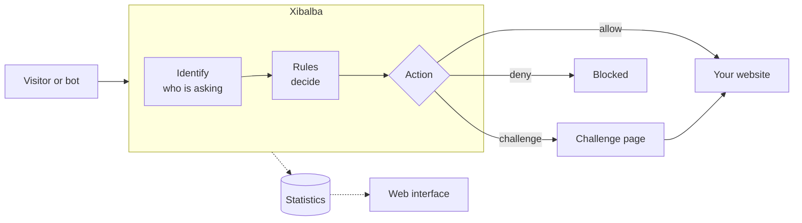

<p align="center">
  
</p>

<p align="center">
  <a href="docs/ROADMAP.md"></a>
  <a href="LICENSE"></a>
  
</p>

Xibalba is a self-hosted gate that sits in front of a website. It turns away AI
crawlers and abusive bots, lets wanted crawlers through, and shows the site
owner what it did.

It is built for organisations that need this to be dependable and presentable:
public authorities, universities and small firms. That means an accessible
challenge page, no tracking, no third-party requests, and one program you run
on your own server.

> [!IMPORTANT]
> Xibalba is in early development. Today it runs in front of a website and
> passes every request through; the bot handling is being built. The table
> below says exactly what exists.

## What it will do



- **Treats crawlers by purpose.** Crawlers that collect training data are
  blocked by default. Crawlers that answer a person's question and link back
  to you are let through, like a search engine.
- **Checks identity, not just the name.** A crawler is trusted only if it comes
  from its operator's published addresses.
- **Challenges the rest.** Unidentified traffic gets a challenge that browsers
  pass and bulk scrapers find expensive. It works without JavaScript.
- **Your rules.** Ready-made presets for normal use, a full rule engine for
  experts, and block and allow lists for addresses and ranges.
- **Shows its work.** A web interface with what was allowed, challenged and
  denied, without storing visitors' IP addresses by default.

## Status

| Part | State |
|---|---|
| Configuration with line-accurate error messages | Built |
| Health reporting per component | Built |
| Start-up, shutdown and failure isolation | Built |
| Reverse proxy with websocket and streaming support | Built |
| Real client address behind trusted proxies, spoofed headers ignored | Built |
| Rule engine | Next |
| Challenge page | Planned |
| Crawler classes and identity checks | Planned |
| Statistics and web interface | Planned |

The order and the details are in the [roadmap](docs/ROADMAP.md).

## Try it

You need Go 1.24 or newer and a website to put Xibalba in front of. The
example configuration expects one at `http://127.0.0.1:3000`; change
`upstream.url` if yours is elsewhere.

```sh
git clone https://github.com/MaMoja/xibalba.git
cd xibalba
make build
cp xibalba.example.yaml xibalba.yaml
./bin/xibalba -config xibalba.yaml
```

Your website now answers through Xibalba on port 8080:

```sh
curl http://127.0.0.1:8080/
```

The health report lists every part separately:

```sh
curl http://127.0.0.1:9090/healthz
```

```json
{
  "state": "ok",
  "components": {
    "ops": {
      "state": "ok"
    },
    "public": {
      "state": "ok"
    },
    "upstream": {
      "state": "ok"
    }
  }
}
```

If the website goes away, visitors get a plain "unavailable" page and the
report says which part has the problem, while Xibalba itself keeps running:

```json
{
  "state": "degraded",
  "components": {
    "ops": {
      "state": "ok"
    },
    "public": {
      "state": "ok"
    },
    "upstream": {
      "state": "degraded",
      "detail": "the last request to 127.0.0.1:3000 failed: dial tcp 127.0.0.1:3000: connect: connection refused"
    }
  }
}
```

Check a configuration file without starting anything:

```sh
./bin/xibalba -check -config xibalba.yaml
```

A mistake in the file is reported with its line and how to fix it:

```text
configuration xibalba.yaml: 1 problem
  - line 2, log.level: "loud" is not a log level
    fix: use one of: debug, info, warn, error
```

## Documentation

| Document | What it covers |
|---|---|
| [Configuration](docs/CONFIGURATION.md) | Every setting, its default and its allowed values |
| [Architecture](docs/ARCHITECTURE.md) | How the program is divided and how failures are contained |
| [Development](docs/DEVELOPMENT.md) | Building, testing and adding a component |
| [Specification](docs/SPEC.md) | What Xibalba is meant to do |
| [Roadmap](docs/ROADMAP.md) | What is built and what comes next |
| [Decisions](docs/DECISIONS.md) | Why things are the way they are |

## Design principles

- **One job per part.** Each package does one thing and can be read, tested
  and replaced on its own.
- **Failures stay where they happen.** A problem in one component is reported
  under that component's name and does not take the others down.
- **Safe defaults.** Nothing listens publicly, stores personal data or trusts
  a header unless the configuration says so.
- **Configurable, with explanations.** Every setting is documented and
  validated, and every error says how to fix it.

## Contributing and security

See [CONTRIBUTING.md](CONTRIBUTING.md). Please report security problems
privately as described in [SECURITY.md](SECURITY.md).

## Licence

[MIT](LICENSE).

Xibalba is an independent project inspired by
[Anubis](https://github.com/TecharoHQ/anubis). It shares no code with it.
