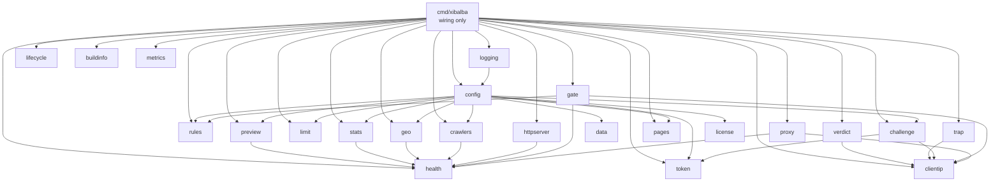
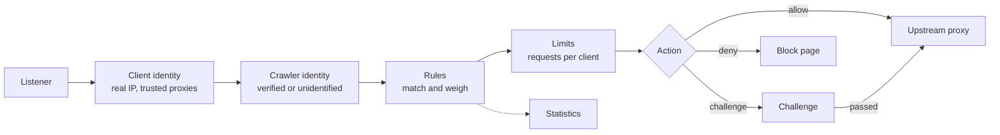

# Architecture

This document explains how Xibalba is divided into parts, how the parts talk to
each other, and what happens when one of them fails. Sections marked
**planned** describe the agreed design for parts that are not built yet.

## Principles

1. **One job per package.** A package has a single responsibility stated in the
   first line of its package comment. If that line needs the word "and", the
   package is split.
2. **Dependencies point one way.** `cmd/xibalba` wires packages together.
   Packages under `internal/` never import `cmd/`, and feature packages do not
   import each other sideways; they meet through small interfaces.
3. **Every part has a name.** The same name appears in the logs
   (`component=...`), in error messages, and in the health report. Finding
   what broke means reading one name.
4. **Failures stay where they happen.** See the table below.
5. **Validate once, at the edge.** Configuration is checked completely at
   start-up. Code past that point works with values it can trust.
6. **No hidden state.** No package-level variables that change at run time, no
   `init()` side effects. Everything a part needs is passed to its constructor.

## The parts today



`gate`, `challenge` and `proxy` do not import `pages`: they are handed the
functions that write a page. `gate` uses the rule engine and the challenge
through small interfaces and imports neither implementation of the latter.
`rules` and `crawlers` do not know each other: `rules` tests a `Crawler` value
that `cmd/xibalba` fills from what `crawlers` found, and gets the list of
valid classes and names as plain text from `config`.
`config` imports the feature packages only to validate their settings with
the same code that later uses them.

| Package | Its one job |
|---|---|
| `cmd/xibalba` | Wire the parts together and wait for a signal or a failure |
| `internal/config` | Turn the YAML file into a validated `Config`, or explain what is wrong |
| `internal/logging` | Build the structured logger from the configuration |
| `internal/lifecycle` | Start and stop components in order and attribute failures to them |
| `internal/health` | Collect each component's state and report it |
| `internal/httpserver` | Run one HTTP listener with timeouts, limits and panic recovery |
| `internal/clientip` | Work out the real address of the client behind a request |
| `internal/rules` | Decide what happens to a request: compile a rule set, evaluate requests against it |
| `internal/crawlers` | Know the crawlers of the web and tell a genuine one from an impostor |
| `data` | Hold the crawler definitions and presets that are built into the binary |
| `internal/limit` | Count requests per client and say when a client is over a limit |
| `internal/geo` | Say which country an address is registered in, from a database file |
| `internal/trap` | Catch crawlers that follow a link no person can see; optionally keep them busy in a maze |
| `internal/verdict` | Answer a web server's question whether a request may pass (subrequest authentication) |
| `internal/preview` | Remember the link-preview tags of the website's pages, fetched in the background |
| `internal/stats` | Keep the other parts' counters on disk by the hour, with a time limit |
| `internal/origin` | Count requests per network of origin, in a bounded table |
| `internal/admin` | Serve the optional web interface: login, overview, and settings if allowed |
| `internal/changes` | Keep what was changed in the web interface, in a file of its own |
| `internal/metrics` | Serve the numbers of the other parts in the Prometheus text format |
| `internal/gate` | Enforce rule decisions on live requests and count them |
| `internal/token` | Sign and verify the tokens handed to clients; keep the signing key |
| `internal/challenge` | Make a client pass a check, verify its answer, recognise its pass |
| `internal/license` | Verify sponsor licenses (signature and term), offline |
| `internal/pages` | Render the pages Xibalba itself shows to visitors |
| `internal/proxy` | Forward an allowed request to the website and answer when it cannot be reached |
| `internal/buildinfo` | Say which build is running |

## Components and the supervisor

Everything that runs is a `lifecycle.Component`:

```go
type Component interface {
    Name() string
    Start(ctx context.Context) error
    Stop(ctx context.Context) error
}
```

The supervisor starts components in the order they were added and stops them
in reverse. A component that can become unhealthy while running also registers
a check with the health registry and gets a reporter function for failures it
cannot recover from.

## How failures are contained

| What goes wrong | What happens | Where you see it |
|---|---|---|
| Configuration file has mistakes | The program does not start. All mistakes are listed with file, line, setting and fix. | Standard error, exit code 1 |
| A component cannot start (port taken, file missing) | Components already started are stopped again in reverse order. The error names the component. | Log line `start-up failed`, exit code 1 |
| A component panics during start or stop | The panic becomes an error for that component; the sequence continues as above. | Same |
| A handler panics while serving a request | That request gets a plain 500. The stack is logged. Other requests are unaffected. | Log line `panic while serving request` with `component` |
| The website is unreachable or too slow | The visitor gets a neutral 502 or 504 page. `upstream` turns `degraded`; `/healthz` stays 200 because Xibalba itself works. It returns to `ok` with the next answered request. | Log line `request to the website failed` with `component=upstream`, `/healthz` |
| A visitor closes the connection mid-request | Nothing is recorded as a failure. | Debug log only |
| A client sends forged forwarding headers | They are discarded unless the connection comes from a trusted proxy. | Not logged: this is normal traffic |
| A rule or rule file has a mistake | The program does not start. Every mistake is listed with file, line, setting and fix. | Standard error, exit code 1 |
| Evaluating a request fails inside Xibalba | The configured answer applies (`rules.on_error`): the request is passed on, or refused with a 503 page. `rules` turns `degraded` for five minutes. One log line per burst, not per request. | Log line `a request could not be evaluated` with `component=rules`, `/healthz`, `failures` in `/decisions` |
| The signing key file is damaged, unreadable or cannot be created | The program does not start and says which file and why. `-check` finds this beforehand without creating anything. | Log line `start-up failed` with `component=challenge`, exit code 1 |
| A client sends a wrong, expired, forged or foreign answer to a challenge | It gets a new task and a short note. No pass. Counted as `failed`. | `challenge.failed` in `/decisions` |
| The system's random source fails while issuing a task | That request gets a plain 503. | Log line `no random numbers available` with `component=challenge` |
| The sponsor license file is missing, damaged or not issued by the project | The program does not start and says so, like any wrong setting. | Standard error, exit code 1 |
| The sponsor license has expired | The program starts and runs. For 30 days nothing changes; after that the visitor pages use the standard wording and show the Xibalba line. | Warning in the log with `component=license`; `license` is `degraded` in `/healthz` |
| A crawler definition file has a mistake | The program does not start. Every mistake is listed with file, setting and fix. | Standard error, exit code 1 |
| An address list cannot be downloaded, or its content is refused | The previous list stays in use; the download is retried after 1, 5 and 30 minutes. Without a previous list the crawlers concerned are "unknown": not let through as crawlers, not denied as impostors. Requests are served as usual. | One warning per outage with `component=crawlers`; `crawlers` is `degraded` in `/healthz`; `list_error` in `/crawlers` |
| An address list has not been renewed for over a week | It is no longer used; as above. | Same |
| DNS does not answer | The reverse DNS check decides nothing and is retried after a minute. Crawlers verified that way are "unknown" meanwhile. | `pending` in `/crawlers` |
| More clients are active than the limit table holds | Older entries make way; their counts start again. Requests are served as usual. | `clients` in `/limits` stays at `limits.max_clients` |
| A question for a verdict does not come from a trusted proxy, or names no address | It is answered 403 and nothing is decided. With nginx the visitor then sees nginx's own "forbidden". | `xibalba_verdicts_total{outcome="refused"}` |
| The web server cannot reach Xibalba for a verdict | The web server decides: nginx, Caddy and Traefik answer the visitor with an error and pass nothing on. | The web server's log |
| The website does not answer a fetch of link-preview tags | The challenge page for that address has no tags; the fetch is tried again after five minutes at the earliest. No request waits or fails. | `previews` is `degraded` in `/healthz` until a fetch succeeds |
| More addresses are asked for than preview tags can be fetched or kept | Fetches beyond 64 waiting are dropped; the table makes room by forgetting pages. | `xibalba_preview_fetches_total{result="dropped"}` |
| More clients were caught in the trap than its table holds | Older entries make way and are no longer treated as caught. | `clients` in `/trap` |
| The database of network operators is missing, damaged or cannot be downloaded | As for the country database: the one loaded stays in use; with none loaded, rules with an `asn` condition are skipped. | `asn` is `degraded` in `/healthz` |
| An address list has a line that is not an address, or its file is missing | The program does not start and names file and line. | Standard error, exit code 1 |
| The country database is missing, damaged or cannot be downloaded | The database already loaded stays in use. If none is loaded, rules with a `country` condition are skipped; everything else works. A damaged file given in the configuration without downloading stops the start, like any wrong setting. | One warning with `component=countries`; `countries` is `degraded` in `/healthz` |
| A listener dies while running | The component reports the failure, health turns `down`, the program shuts down cleanly and exits with code 1 so the service manager restarts it. | Log line `component failed`, `/healthz` |
| A change made in the web interface gives a rule set that does not work, or cannot be written to the changes file | The change is refused and explained on the page; the rule set in force stays (or is put back). | The page itself; `not saved` in the answer |
| The changes file is damaged or holds something invalid at start | Xibalba does not start, like with any wrong setting, and says which file. | Message of `xibalba -check` |
| The web interface fails while building a page | That request gets status 500; the website and the other listeners are not affected. If its listener dies, the rule for listeners above applies. | Log line with `component=admin`; `admin` in `/healthz` |
| A part fails while its numbers are collected for `/metrics` | Its numbers are left out of that answer; the others are served. | Missing series in the monitoring system |
| The statistics directory is gone or the disk is full | Requests are served as before. What is counted meanwhile is written when writing works again. | One warning with `component=statistics`; `statistics` is `degraded` in `/healthz` |
| The counts per network cannot be written, or requests come from more networks than the table holds | Requests are served as before. Networks beyond the table are counted as `other`. | `statistics-networks` is `degraded` in `/healthz` when writing fails |
| A health check itself panics | Only that component is reported `down`. The other checks still run. | `/healthz` |
| Shutdown takes too long | Components get `shutdown_timeout`; whatever did not stop is named in the log. | Log line `shutdown was not clean` |

## Request pipeline

The public side is a pipeline of stages. Each stage is a small interface, so a
stage can be tested alone, swapped, or switched off in configuration.

Built today: the listener, client identity, rules with the block page, the
crawler identity, request limits, the challenge, and the upstream proxy. Lasting statistics
are **planned**.

Requests under `/.xibalba/` are Xibalba's own (the challenge's answer
address and, if switched on, the trap). They are routed to the challenge right after client identity and
never reach the rules or the website.



Stages hand information forward through the request context. Client identity
stores a `clientip.Info` (client address, peer address, whether the peer is a
trusted proxy); every later stage reads it from there and never looks at
forwarding headers itself.

Planned packages and their seams:

| Package | Its one job | Interface it exposes |
|---|---|---|

Two rules apply to every stage:

- **A stage that fails has a configured answer.** Each stage that can fail at
  run time (identity lookups, statistics storage, challenge storage) has a
  `fail_open` or `fail_closed` setting. A broken statistics store must never
  stop a website from being served.
- **No network calls while a request waits.** Lookups such as reverse DNS and
  published address lists are refreshed in the background and read from memory.

## Extension points

Things a user or a contributor is expected to add without touching the core.
Rules and translations work today; the rest is **planned**.

- **Rules and rule sets**: data files, loaded and validated at start-up. See [RULES.md](RULES.md).
- **Translations of visitor pages**: one JSON file per language in `internal/pages/assets/locales`, plus its code in the language list of that package. A test checks that every language has every text.
- **Crawler definitions**: data files, built in (`data/crawlers/`) or your own (`crawlers.files`) (built). See [CRAWLERS.md](CRAWLERS.md).
- **Challenge methods**: a client names the method it answered with (`pow`, `button`); each is verified by its own branch in `internal/challenge`. Selecting a method or difficulty per rule is planned.
- **Storage backends**: implement the storage interface for challenge state or statistics.
- **Wording of visitor pages**: operator name, contact line and any text, from the `pages` section of the configuration (built).
- **Branding**: customer logo and accent colour from configuration.

## Adding a component

1. Create a package under `internal/` with a package comment whose first line
   states its one job.
2. Implement `lifecycle.Component`. Bind ports and open files in `Start`, so
   problems surface at start-up.
3. If it can become unhealthy, add a `Health() health.Status` method and
   register it in `cmd/xibalba`.
4. Add its settings to `internal/config`, `xibalba.example.yaml` and
   `docs/CONFIGURATION.md` in the same change.
5. Write tests for the failure cases first.
6. Add a row to the tables in this document.
