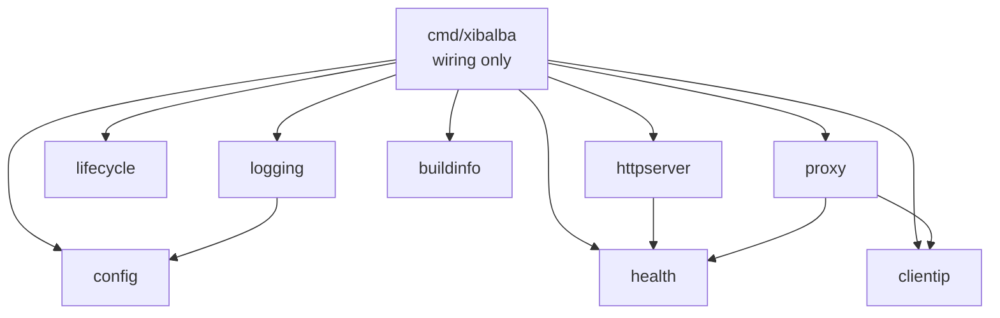
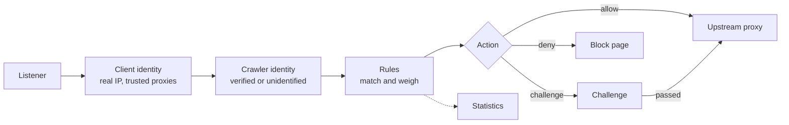

# Architecture

This document explains how Xibalba is divided into parts, how the parts talk to
each other, and what happens when one of them fails. Sections marked
**planned** describe the agreed design for parts that are not built yet.

## Principles

1. **One job per package.** A package has a single responsibility stated in the
   first line of its package comment. If that line needs the word "and", the
   package is split.
2. **Dependencies point one way.** `cmd/xibalba` wires packages together.
   Packages under `internal/` never import `cmd/`, and feature packages do not
   import each other sideways; they meet through small interfaces.
3. **Every part has a name.** The same name appears in the logs
   (`component=...`), in error messages, and in the health report. Finding
   what broke means reading one name.
4. **Failures stay where they happen.** See the table below.
5. **Validate once, at the edge.** Configuration is checked completely at
   start-up. Code past that point works with values it can trust.
6. **No hidden state.** No package-level variables that change at run time, no
   `init()` side effects. Everything a part needs is passed to its constructor.

## The parts today



| Package | Its one job |
|---|---|
| `cmd/xibalba` | Wire the parts together and wait for a signal or a failure |
| `internal/config` | Turn the YAML file into a validated `Config`, or explain what is wrong |
| `internal/logging` | Build the structured logger from the configuration |
| `internal/lifecycle` | Start and stop components in order and attribute failures to them |
| `internal/health` | Collect each component's state and report it |
| `internal/httpserver` | Run one HTTP listener with timeouts, limits and panic recovery |
| `internal/clientip` | Work out the real address of the client behind a request |
| `internal/proxy` | Forward an allowed request to the website and answer when it cannot be reached |
| `internal/buildinfo` | Say which build is running |

## Components and the supervisor

Everything that runs is a `lifecycle.Component`:

```go
type Component interface {
    Name() string
    Start(ctx context.Context) error
    Stop(ctx context.Context) error
}
```

The supervisor starts components in the order they were added and stops them
in reverse. A component that can become unhealthy while running also registers
a check with the health registry and gets a reporter function for failures it
cannot recover from.

## How failures are contained

| What goes wrong | What happens | Where you see it |
|---|---|---|
| Configuration file has mistakes | The program does not start. All mistakes are listed with file, line, setting and fix. | Standard error, exit code 1 |
| A component cannot start (port taken, file missing) | Components already started are stopped again in reverse order. The error names the component. | Log line `start-up failed`, exit code 1 |
| A component panics during start or stop | The panic becomes an error for that component; the sequence continues as above. | Same |
| A handler panics while serving a request | That request gets a plain 500. The stack is logged. Other requests are unaffected. | Log line `panic while serving request` with `component` |
| The website is unreachable or too slow | The visitor gets a neutral 502 or 504 page. `upstream` turns `degraded`; `/healthz` stays 200 because Xibalba itself works. It returns to `ok` with the next answered request. | Log line `request to the website failed` with `component=upstream`, `/healthz` |
| A visitor closes the connection mid-request | Nothing is recorded as a failure. | Debug log only |
| A client sends forged forwarding headers | They are discarded unless the connection comes from a trusted proxy. | Not logged: this is normal traffic |
| A listener dies while running | The component reports the failure, health turns `down`, the program shuts down cleanly and exits with code 1 so the service manager restarts it. | Log line `component failed`, `/healthz` |
| A health check itself panics | Only that component is reported `down`. The other checks still run. | `/healthz` |
| Shutdown takes too long | Components get `shutdown_timeout`; whatever did not stop is named in the log. | Log line `shutdown was not clean` |

## Request pipeline

The public side is a pipeline of stages. Each stage is a small interface, so a
stage can be tested alone, swapped, or switched off in configuration.

Built today: the listener, client identity, and the upstream proxy. A request
currently goes straight from client identity to the proxy. The stages in
between are **planned**.



Stages hand information forward through the request context. Client identity
stores a `clientip.Info` (client address, peer address, whether the peer is a
trusted proxy); every later stage reads it from there and never looks at
forwarding headers itself.

Planned packages and their seams:

| Package | Its one job | Interface it exposes |
|---|---|---|
| `internal/identity` | Decide whether a claimed crawler is genuine | `Verifier` |
| `internal/rules` | Evaluate a request against the rule set | `Engine` returning a `Decision` |
| `internal/challenge` | Issue and verify challenges and pass tokens | `Challenger` per challenge type |
| `internal/stats` | Count decisions | `Recorder` |
| `internal/admin` | Serve the web interface | `http.Handler` |

Two rules apply to every stage:

- **A stage that fails has a configured answer.** Each stage that can fail at
  run time (identity lookups, statistics storage, challenge storage) has a
  `fail_open` or `fail_closed` setting. A broken statistics store must never
  stop a website from being served.
- **No network calls while a request waits.** Lookups such as reverse DNS and
  published address lists are refreshed in the background and read from memory.

## Extension points (planned)

Things a user or a contributor is expected to add without touching the core:

- **Rules and rule sets**: data files, loaded and validated at start-up.
- **Crawler definitions**: data files under `data/crawlers/`.
- **Challenge types**: implement `Challenger`, register under a name, select it in a rule.
- **Storage backends**: implement the storage interface for challenge state or statistics.
- **Translations and branding**: files, not code.

## Adding a component

1. Create a package under `internal/` with a package comment whose first line
   states its one job.
2. Implement `lifecycle.Component`. Bind ports and open files in `Start`, so
   problems surface at start-up.
3. If it can become unhealthy, add a `Health() health.Status` method and
   register it in `cmd/xibalba`.
4. Add its settings to `internal/config`, `xibalba.example.yaml` and
   `docs/CONFIGURATION.md` in the same change.
5. Write tests for the failure cases first.
6. Add a row to the tables in this document.
