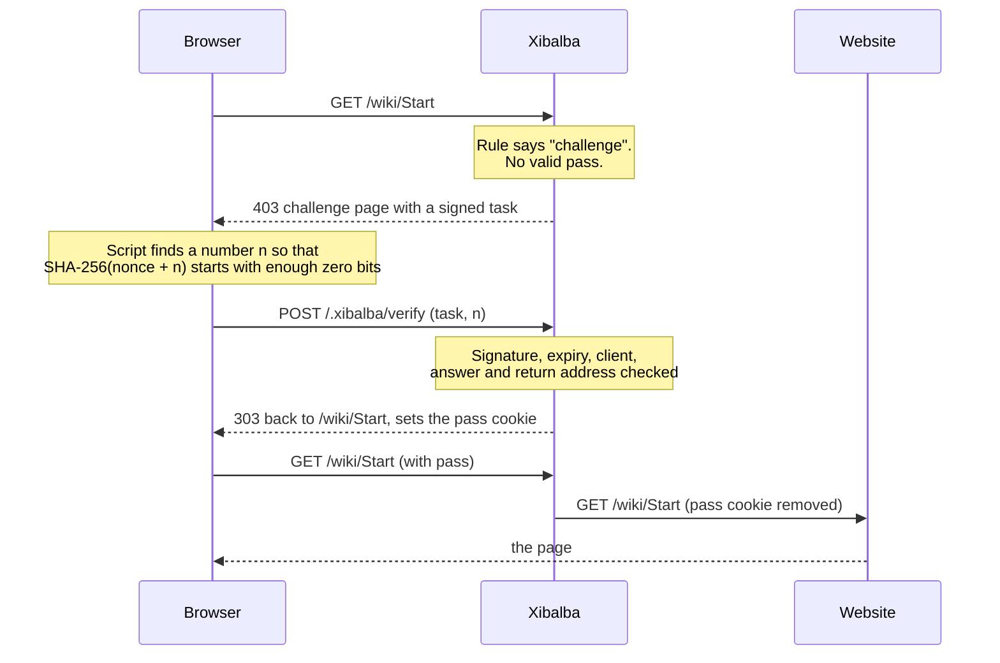

# The security check (challenge)

When a rule or threshold decides `challenge`, the client has to pass a short
check before its requests reach the website. This document explains what the
check is, what it stops and what it does not, and every setting that controls it.

Which requests are challenged is decided by your rules; see [RULES.md](RULES.md).
With the default configuration nothing is challenged.

## What a visitor experiences

**With JavaScript (nearly everyone).** Instead of the page they asked for, the
visitor sees a short page saying that a security check is running. Their
browser solves a small calculation by itself, usually in well under a second,
and the page they wanted appears. They do not have to do anything. For the
next week (configurable) they are not asked again.

**Without JavaScript.** The same page explains that the browser does not run
JavaScript and asks the visitor to wait a few seconds and press "Continue".
You can switch this path off, in which case the page says that JavaScript is
needed.

The page is plain and calm, in German or English by the visitor's browser
language with the other language one click away, usable by keyboard and
screen reader, and it loads nothing from any other server. Its wording can be
changed in the `pages` section (see [CONFIGURATION.md](CONFIGURATION.md#pages)).

## How it works



- The **task** is a signed token. It names a random value (nonce), the
  difficulty, when it expires, and which client it was issued to.
- The **proof of work**: find a number that, appended to the nonce, gives a
  SHA-256 hash starting with `difficulty` zero bits. Finding it takes many
  tries; checking it takes one.
- The **pass** is a signed cookie. It only states "passed until this time, for
  this client". The website behind Xibalba never sees it: Xibalba removes the
  cookie before passing a request on.
- **Nothing is stored on the server.** Task and pass are verified by their
  signature. This is why several Xibalba instances can share the work if they
  share the key file.

A task and a pass are tied to the client: always to its browser's user agent
and, unless you switch it off, to its network (the /24 of an IPv4 address,
the /64 of an IPv6 address). A pass copied to a machine elsewhere is worthless.
The tie is a keyed hash; neither the address nor the user agent can be read
from the cookie.

## What it stops, and what it does not

It stops clients that fetch pages without behaving like a browser: simple
crawlers and scrapers that do not run JavaScript and do not fill in forms,
which is most of the bulk traffic that causes load. It also makes each new
identity cost something, and it prevents one solved check from being shared
across a fleet.

It does not stop a client that drives a real browser. Such a client passes
like a person does. It also does not replace rules: use `deny` for what you
never want, and `challenge` for what should be available to people but not to
bulk fetchers.

If the path without JavaScript is on (`no_javascript: button`), a crawler can
take it too, by waiting and submitting the form. That is a deliberate
trade-off in favour of visitors who cannot run JavaScript. Set
`no_javascript: deny` if you prefer the stricter check.

## Settings

All settings are in the `challenge` section of the configuration file.

| Setting | Default | Allowed values | Meaning |
|---|---|---|---|
| `challenge.method` | `pow` | `pow`, `script`, `wait`, `refresh` | The kind of check; see [Kinds of check](#kinds-of-check). |
| `challenge.checks` | none | `css`, `headless` | Extra checks on top of `pow` or `script`; see [Extra checks](#extra-checks). |
| `challenge.difficulty` | `18` | `8` to `24` | For `pow`: leading zero bits the hash must have. Each step up doubles the browser's work. |
| `challenge.no_javascript` | `button` | `button`, `deny` | What visitors without JavaScript get: wait and press a button, or a note that JavaScript is needed. |
| `challenge.wait` | `3s` | `1s` to `1m` | How long a visitor has to wait: the whole check with `wait` and `refresh`, before the script answers with `script`, and before the button counts for a visitor without JavaScript. |
| `challenge.challenge_lifetime` | `5m` | `30s` to `1h`, longer than `wait` | How long a client has to finish. After that it simply gets a new task. |
| `challenge.pass_lifetime` | `168h` | `1m` to `8760h` | How long a client is not asked again after passing. `168h` is one week. Durations use `s`, `m` and `h`; there is no unit for days. |
| `challenge.bind_network` | `true` | `true`, `false` | Tie the pass to the client's network as well as its user agent. |
| `challenge.key_file` | empty | Path, relative to the configuration file | Where the signing key is kept. See below. |
| `challenge.cookie_name` | `xibalba-pass` | Letters, digits, `-`, `_`; up to 64 characters | Name of the pass cookie. |

These settings describe the **default check**. A rule or threshold can ask
for a different one; see [A check of its own for a rule](#a-check-of-its-own-for-a-rule).

## Kinds of check

| `method` | What the visitor's browser does | Needs JavaScript | What it costs a crawler | Use it for |
|---|---|---|---|---|
| `pow` | Solves a calculation; `difficulty` says how much | Yes (with `no_javascript: button`, visitors without it wait and press a button) | Computing time for every pass | The default. Mass fetching becomes expensive. |
| `script` | Runs a small script and waits `wait`; nothing is calculated | Yes (same path without it as `pow`) | It has to run a real browser, or copy what the script does | Old phones and slow machines; requests you only suspect a little |
| `wait` | Nothing. The visitor waits `wait` and presses a button | No | Almost nothing: a program can wait and send the form | Places where JavaScript must not be required, as a brake rather than a barrier |
| `refresh` | Nothing. After `wait` the page sends the browser on by itself | No | Almost nothing | As `wait`, without the click |

Every kind ends the same way: a signed pass in a cookie, and the visitor is
on the page that was asked for.

**`refresh` and logs.** The forward of `refresh` carries the task in the
address. The task is useless to anyone but the client it was issued to and
expires after `challenge_lifetime`, and your website never sees it, but it
does appear in the access log of a web server in front of Xibalba and in
the browser's history.

**`refresh` and accessibility.** The page of `refresh` moves the visitor on
after a time the visitor cannot extend. WCAG 2.1 (success criterion 2.2.1)
asks not to do that, and the project's accessibility check reports exactly
this one finding for it. The page is one short paragraph and also has a
button, but if your website has to meet BITV or WCAG, use `wait`, `script`
or `pow` instead.

## Extra checks

Extra checks are added to `pow` or `script` with `checks`. They run in the
page's script, so the path without JavaScript is closed for a check that
lists one.

| Check | What it does | What it catches | What it does not |
|---|---|---|---|
| `css` | The page links a style sheet of Xibalba's own that carries a value belonging to this one task. The script reads the value back from the page once the browser has applied the style sheet, and sends it along. | Programs that fetch the page and solve the task without behaving like a browser: they do not load style sheets | A program that fetches the style sheet on purpose |
| `headless` | The script looks for signs that a program steers the browser: the browser says so itself, or a known automation tool has left its marks. | Automated browsers used without care, which is most of them | A browser that was prepared to hide these signs. The report comes from the client, and a client can lie. |

A browser that reports automation gets a page that says so and stops there,
with a link to try again; it does not try again by itself. Only signs that an
ordinary browser never shows are used, so that people with unusual browsers
are not locked out. If the style sheet of `css` never arrives (an extension
that blocks style sheets), the page says so and stops as well. The number of such answers is in the
counts as `challenge|automated` and in the metrics as
`xibalba_challenge_total{result="automated"}`.

Neither check stores anything, and neither loads anything from another host.

## A check of its own for a rule

Every rule and threshold with `action: challenge` can describe the check it
asks for. What it leaves out is taken from the default check.

```yaml
rules:
  thresholds:
    - weight: 10
      action: challenge
      challenge: {method: pow, difficulty: 22}
  list:
    - name: gentle-for-the-archive
      match:
        path: {prefix: "/archiv"}
      action: challenge
      challenge:
        method: script
        wait: 2s
    - name: strict-for-search
      match:
        path: {prefix: "/suche"}
      action: challenge
      challenge:
        method: pow
        difficulty: 20
        checks: [css, headless]
```

| Key under `challenge` | Meaning |
|---|---|
| `method` | `pow`, `script`, `wait` or `refresh` |
| `difficulty` | For `pow`: 8 to 24 |
| `wait` | `1s` to `1m` |
| `checks` | `[css]`, `[headless]`, both, or `[]` for none |
| `no_javascript` | `button` or `deny`, for `pow` and `script` |

**What a pass counts for.** A pass remembers how demanding the check was
that earned it. It counts wherever the same or less is asked: a pass from
`pow` with difficulty 20 also opens what asks for `pow` 18, `script`,
`wait` or `refresh`, but not `pow` 22, and not a check with `css` or
`headless` unless the pass was earned with it. A visitor who meets a harder
check later solves it once and keeps what was earned before. A check that a
request limit brings about is always the default one.

Two things follow from this:

- **A pass earned by waiting counts only as that.** Where `pow` or `script`
  leave the path without JavaScript open (`no_javascript: button`), a
  visitor can pass by waiting and pressing the button. Such a pass opens
  what `wait` and `refresh` ask for, and other checks whose button is open,
  but not a check with `no_javascript: deny` or with extra checks. For a
  rule that must cost a calculation, set `no_javascript: deny` on it.
- **The length of the wait is not part of a pass.** A pass from a check with
  `wait: 1s` also counts where a rule asks for `wait: 30s`.

### Recipes

**A harder check for everyone outside Europe.** Needs a country database
([Countries](COUNTRIES.md)); the list is the EU with Iceland, Liechtenstein,
Norway, Switzerland and the United Kingdom, change it to what you mean by
Europe.

```yaml
countries:
  database: countries.mmdb
rules:
  list:
    - name: check-outside-europe
      match:
        not:
          country: ["AT", "BE", "BG", "HR", "CY", "CZ", "DK", "EE", "FI", "FR", "DE", "GR", "HU", "IE", "IT", "LV", "LT", "LU", "MT", "NL", "PL", "PT", "RO", "SK", "SI", "ES", "SE", "IS", "LI", "NO", "CH", "GB"]
      action: challenge
      challenge:
        method: pow
        difficulty: 20
        checks: [headless]
```

While no country database is loaded, a rule with a country condition is
skipped. An address the database does not know is in no country, and so
"outside Europe".

**A check for certain networks.**

```yaml
rules:
  list:
    - name: check-hosting-networks
      match:
        ip: ["198.51.100.0/24", "2001:db8:5::/48"]
      action: challenge
      challenge: {method: pow, difficulty: 22}
```

**No check for your own network, a gentle one for everyone else.** Put the
allow rule first; the first rule that decides wins.

```yaml
rules:
  default_action: challenge
  list:
    - name: allow-office
      match:
        ip: ["192.0.2.0/24"]
      action: allow
challenge:
  method: script
```

**VPNs and hosting providers.** Two conditions are made for this: `asn`
(all addresses of a network operator, by its number) and `address_list` (a
list of addresses in a file, for example the exits of VPN providers).
Xibalba ships no such list; you choose them. See
[NETWORKS.md](NETWORKS.md).

```yaml
asn:
  database: asn.mmdb
rules:
  address_lists:
    vpn: lists/vpn.txt
  list:
    - name: check-vpn-and-hosting
      match:
        any:
          - address_list: [vpn]
          - asn: [64500, 64501]
      action: challenge
      challenge: {method: pow, difficulty: 20, checks: [headless]}
```

### Difficulty

| `difficulty` | Tries on average | On the development machine |
|---|---|---|
| 16 | 65,536 | about 0.03 s |
| 18 (default) | 262,144 | about 0.1 s |
| 20 | 1,048,576 | about 0.4 s |
| 22 | 4,194,304 | about 1.6 s |
| 24 | 16,777,216 | about 6 s |

The times follow from a measured 2.7 million tries per second in the page's
script on the development machine. Phones and old computers are several times
slower; we have not measured them. The work is a matter of luck: a single
check can take a few times longer or shorter than the average. Start with the
default and raise it only if bulk fetchers still get through.

### The key file

Tasks and passes are signed with a secret key.

- **`key_file` empty (default):** Xibalba makes a new key at every start. This
  works, but every visitor is checked again after each restart, and Xibalba
  says so in the log. Fine for trying things out.
- **`key_file` set:** the key is read from that file. If the file does not
  exist, Xibalba creates it at the first start, readable only by the user
  Xibalba runs as (mode `600`), and logs `created a new signing key`. Its
  directory must exist and be writable for that user.

```yaml
challenge:
  key_file: /var/lib/xibalba/xibalba.key
```

Treat the file like a password. Whoever has it can make passes. To invalidate
every pass at once, stop Xibalba, delete the file and start again. To run
several instances behind a load balancer, give them the same file.

`xibalba -check` reports a key file that is unreadable, damaged, or in a
directory that does not exist, without creating anything.

### `bind_network`

With `true`, a visitor whose address moves to another network (mobile data to
home Wi-Fi, for example) is checked again once; it takes them a moment. With
`false`, a pass works from any address with the same browser, which also means
it can be copied to other machines that send the same user agent. Leave it on
unless many of your visitors change networks constantly.

## The reserved address `/.xibalba/`

Addresses that start with `/.xibalba/` are answered by Xibalba itself and are
never passed to your website. Today there is one: `/.xibalba/verify`, where
the browser sends its answer. Your website must not use paths under
`/.xibalba/`.

## The cookie

| Property | Value |
|---|---|
| Name | `xibalba-pass` (configurable) |
| Content | A signed statement: valid until when, and a keyed hash tying it to the client. No address, no identifier of the person, nothing about what was visited. |
| Lifetime | `challenge.pass_lifetime` |
| Flags | `HttpOnly`, `SameSite=Lax`, `Path=/`; `Secure` when the visitor came over HTTPS |
| Seen by your website | No. Xibalba removes it from requests it passes on. |

`Secure` is set when Xibalba itself received the request over TLS, or when a
proxy listed in `server.trusted_proxies` reports `X-Forwarded-Proto: https`.
Make sure your web server sends that header (see the handbook).

The cookie is set only to remember that the security check was passed. Whether
it needs to be mentioned in your privacy notice is for you or your data
protection officer to decide; this section gives the facts for that.

## Content-Security-Policy

Xibalba's own pages (security check, block page and the others) carry their
own strict `Content-Security-Policy`: nothing may be loaded from anywhere,
the one style block and the one script of the security check are allowed by
their checksum, and the page may not be framed. You do not have to set
anything for them.

Two things to know if your web server adds a `Content-Security-Policy` of
its own to every answer:

- A browser applies **both** policies, and a page may only do what both
  allow. A policy from your web server that forbids inline styles or inline
  scripts therefore breaks the security check: the page appears unstyled and
  the calculation never starts (the button for visitors without JavaScript
  still works). Do not add your policy to answers that already carry one,
  or leave the addresses under `/.xibalba/` and answers with status 403
  from Xibalba out of it.
- The policy of your own website is not touched by Xibalba. Answers of your
  website pass through with the headers your website sets.

Xibalba's pages need no exception in your website's policy: they are never
part of your pages, they are shown instead of them.

## Watching it work

`/decisions` on the operations listener shows what became of challenged requests:

```json
"challenge": {
  "served": 1,
  "passed": 0,
  "solved": 0,
  "failed": 0
}
```

| Counter | Meaning |
|---|---|
| `served` | How often the challenge page was shown. |
| `solved` | How many answers were accepted. |
| `failed` | How many answers were rejected: wrong, expired, issued to another client, or the button pressed too early. |
| `passed` | How many requests were let through on a valid pass. |

Many `served` and few `solved` is what a crawler that cannot pass looks like.
The counters hold nothing about who was checked.

With `rules.dry_run: true` nobody is challenged; decisions are only counted.

## Things to know before challenging a path

- **Forms.** If a visitor without a pass submits a form (`POST`) to a
  challenged path, they get the check, and afterwards they arrive at the
  address with a normal page request. What they had typed is not submitted.
  Challenge the pages that lead to a form rather than only its target, so
  visitors already hold a pass when they submit.
- **Programs, not people.** API clients, feed readers, monitoring and
  webhooks cannot pass the check. They receive status `403` and the HTML
  page. Exempt them with an `allow` rule placed above the `challenge` rule,
  by address where possible.
- **Search engines.** A search engine's crawler does not pass either. If you
  challenge pages you want indexed, allow the search engines first.
  Maintained, verified crawler lists are **planned** (milestone M4).
- **Caches in front of Xibalba.** A cache or CDN between your visitors and
  Xibalba must not store challenged pages, or it will hand them out without
  the check. The challenge page itself is sent with `Cache-Control: no-store`
  and status `403`.
- **A wrong or late answer is never a dead end.** The client simply gets a
  new task, with a short note for the visitor.

## What is checked on every answer

For the security-minded reader. Everything a client sends back is untrusted
until verified, in this order:

1. The task's signature, in constant time, before anything in it is read.
2. That it is a task and not a pass (the two kinds are signed with different
   keys and cannot stand in for each other).
3. That it has not expired.
4. That it was issued to this client (network and user agent).
5. The answer: the hash for the proof of work, or the waiting time for the
   button. The difficulty comes from the signed task, never from the client.
6. The address to return to: it must be a path on this website. Anything that
   could lead elsewhere becomes `/`.

The answer form is limited to 8 KiB.
