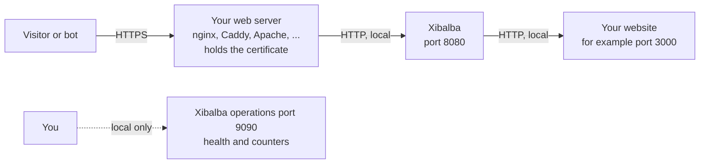

# Getting started

This page takes you from nothing to a protected website in seven steps. It is
written for the person who installs and runs Xibalba.

## What Xibalba does

Xibalba stands in front of your website and decides, for every request, what
happens to it:

| Decision | What the client experiences |
|---|---|
| **Let through** (`allow`) | The request goes to your website as if Xibalba were not there. |
| **Check** (`challenge`) | The visitor's browser solves a short calculation. It usually takes under a second and the visitor does nothing. After that the visitor is not checked again for a week. Simple crawlers fail here. |
| **Block** (`deny`) | The client gets a plain page "This request was blocked". Your website is not contacted. |

You say which request gets which decision with **rules**. Without rules
Xibalba lets everything through.

Xibalba stores **nothing about your visitors**: no addresses, no pages they
asked for. It only counts which rule decided how often.

## How the pieces fit



Three things matter:

- **Xibalba does not do HTTPS itself.** Your web server stands in front,
  holds the certificate and passes requests on to Xibalba.
- **Your website must only be reachable through Xibalba.** If it can also be
  reached directly from the internet, bots simply go around. Let the website
  listen on `127.0.0.1` or in an internal network only.
- **The operations port (9090) is for you alone.** It shows health and
  counters and must not be reachable from the internet. By default it is not.

## Install

Xibalba is one program with nothing else needed at run time. Packages and
images are not published yet (**planned**); today it is built from source.
On the machine you build on you need [Go](https://go.dev/dl/) 1.24 or later,
`git` and `make`.

```sh
git clone https://github.com/MaMoja/xibalba.git
cd xibalba
make build
```

The result is the file `bin/xibalba`. For a server of another kind, such as
a Raspberry Pi, `make cross` produces `dist/xibalba-linux-amd64` and
`dist/xibalba-linux-arm64`. Only that one file is needed on the server.

A usual layout on a Linux server:

| What | Where | Note |
|---|---|---|
| Program | `/usr/local/bin/xibalba` | |
| Configuration | `/etc/xibalba/xibalba.yaml` | |
| Your own rule files | `/etc/xibalba/rules/` | optional |
| Key file, caches, statistics | `/var/lib/xibalba/` | must be writable for Xibalba's user |

Run Xibalba as a user of its own without special rights. To run it as a
service, as a container or in a cluster, see [Environments](ENVIRONMENTS.md).

## Step 1: create the configuration file

Copy the template. It holds every setting with an explanation and its default.

```sh
cp xibalba.example.yaml /etc/xibalba/xibalba.yaml
```

Only one setting is required: where your website is.

```yaml
upstream:
  url: "http://127.0.0.1:3000"
```

## Step 2: check without starting

```sh
xibalba -check -config /etc/xibalba/xibalba.yaml
```

Xibalba checks the whole file and names every mistake with its line, the
setting and the fix:

```text
configuration xibalba.yaml: 4 problems
  - line 4, rules.default_action: "block" is not an action a default can take
    fix: use one of: allow, deny, challenge
  - line 6, rules.list[0].name: "Block Bots" is not a valid rule name
    fix: use lower-case letters, digits, dot, underscore and hyphen, starting with a letter or digit, at most 64 characters
  - line 8, rules.list[0].match.user_agent.regex: the regular expression is not valid: missing closing ): `(GPT|Claude`
    fix: Xibalba uses RE2 syntax, which has no lookahead or backreferences; for plain text use contains
  - line 13, rules.list[1].match.header.X-Forwarded-For: X-Forwarded-For is written by the client and cannot be trusted as an address
    fix: use the ip condition, which tests the address Xibalba established itself
```

Xibalba does not start with a file that has mistakes. A misspelt setting is
a mistake too and is never passed over silently.

## Step 3: start and look at the health

```sh
xibalba -config /etc/xibalba/xibalba.yaml
```

In a second window:

```sh
curl http://127.0.0.1:8080/          # your website, through Xibalba
curl http://127.0.0.1:9090/healthz   # health
```

```json
{
  "state": "ok",
  "components": {
    "ops": {
      "state": "ok"
    },
    "public": {
      "state": "ok"
    },
    "rules": {
      "state": "ok"
    },
    "upstream": {
      "state": "ok"
    }
  }
}
```

## Step 4: put your web server in front

Your web server takes the requests from the internet and passes them on to
Xibalba on port 8080. It has to tell Xibalba the visitor's real address
(`X-Forwarded-For`) and whether the connection was encrypted
(`X-Forwarded-Proto`).

There are tested example files for **nginx, Caddy, Apache, HAProxy and
Traefik**, and examples for containers, systemd and Kubernetes. See
[Environments](ENVIRONMENTS.md).

## Step 5: tell Xibalba which web server to believe

`X-Forwarded-For` is plain text that any sender can write. Xibalba therefore
believes it only when the connection comes from an address you have listed as
your own web server.

```yaml
server:
  trusted_proxies: ["127.0.0.1", "::1"]   # web server on the same machine
```

| Your situation | Entry |
|---|---|
| Web server on the same machine | `["127.0.0.1", "::1"]` (without IPv6 on the machine `["127.0.0.1"]` is enough) |
| Load balancer in an internal network | its address or network, for example `["10.0.0.0/8"]` |
| Visitors reach Xibalba directly | `[]` (leave empty) |

Two typical mistakes:

- **The entry is missing.** All visitors seem to have the same address, your
  web server's. Address rules then match everybody or nobody, request limits
  count everybody together, and the trap catches everybody at once.
- **Too much is listed.** Whoever asks from a listed address can pose as any
  visitor. List only your own servers.

## Step 6: set the key file

For the security check Xibalba signs small proofs with a secret key. Without
a key file it makes a new key at every start, and all visitors are checked
again after every restart.

```yaml
challenge:
  key_file: /var/lib/xibalba/xibalba.key
```

Xibalba creates the file at the first start, readable for its own user only.
The directory must exist and be writable for that user. Treat the file like
a password.

## Step 7: bring rules in with a dry run

Write your first rules and switch on the dry run first:

```yaml
rules:
  dry_run: true
```

In a dry run Xibalba evaluates every request and counts the decisions, but
lets everything through. Watch the counters for a while (see
[Operations](OPERATIONS.md)). When the numbers look right, set
`dry_run: false` and restart Xibalba.

A complete protection in one block, to start from:

```yaml
rules:
  default_action: allow
  presets:
    - keep-internet-working
    - allow-feeds
    - block-fake-crawlers
    - block-ai-training
    - allow-search-engines
    - allow-ai-search
    - allow-ai-user-fetch
    - challenge-browsers
```

Wanted crawlers and plain programs pass, crawlers that collect training data
are denied, and whatever says it is a browser has to prove it. What each line
does is explained in [Rules](RULES.md#presets) and [Crawlers](CRAWLERS.md).

## Where to go from here

| I want to … | Read |
|---|---|
| write my own rules | [Rules](RULES.md) |
| decide about AI crawlers and search engines | [Crawlers](CRAWLERS.md) |
| limit how much one client may ask for | [Limits](LIMITS.md) |
| block or check by country | [Countries](COUNTRIES.md) |
| catch crawlers that follow every link | [Trap](TRAP.md) |
| tune the security check | [Challenge](CHALLENGE.md) |
| put my name and wording on the pages | [Sponsors](SPONSORS.md), [Configuration](CONFIGURATION.md#pages) |
| watch what happens | [Operations](OPERATIONS.md), [Statistics](STATISTICS.md), [Metrics](METRICS.md) |
| look up a setting | [Configuration](CONFIGURATION.md) |
| know what is stored about visitors | [Privacy](PRIVACY.md) |
