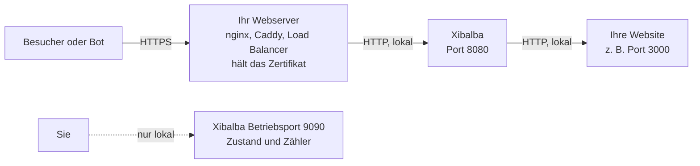

# Xibalba: Handbuch für Betreiber

Dieses Handbuch richtet sich an die Person, die Xibalba vor einer Website
einrichtet und betreibt. Es erklärt, was Xibalba tut, wie man es in Betrieb
nimmt und **wo man was einstellt**.

Stand: Xibalba ist in früher Entwicklung. Was heute funktioniert und was noch
fehlt, steht in [Abschnitt 12](#12-was-xibalba-noch-nicht-kann). Alles in
diesem Handbuch beschreibt den heutigen Stand; was noch nicht gebaut ist, ist
als „geplant“ gekennzeichnet.

**Inhalt**

1. [Was Xibalba tut](#1-was-xibalba-tut)
2. [So ist es aufgebaut](#2-so-ist-es-aufgebaut)
3. [Installation](#3-installation)
4. [Einrichtung in sieben Schritten](#4-einrichtung-in-sieben-schritten)
5. [Wo stelle ich was ein?](#5-wo-stelle-ich-was-ein)
6. [Regeln: wer darf, wer nicht](#6-regeln-wer-darf-wer-nicht)
7. [Die Sicherheitsprüfung](#7-die-sicherheitsprüfung)
8. [Die Seiten für Besucher anpassen](#8-die-seiten-für-besucher-anpassen)
9. [Betrieb: prüfen, beobachten, ändern](#9-betrieb-prüfen-beobachten-ändern)
10. [Datenschutz](#10-datenschutz)
11. [Fehlersuche](#11-fehlersuche)
12. [Was Xibalba noch nicht kann](#12-was-xibalba-noch-nicht-kann)
13. [Weiterführende Dokumente](#13-weiterführende-dokumente)

---

## 1. Was Xibalba tut

Xibalba steht vor Ihrer Website und entscheidet bei jeder Anfrage, was mit ihr
geschieht:

| Entscheidung | Was der Anfragende erlebt |
|---|---|
| **Durchlassen** (`allow`) | Die Anfrage geht an Ihre Website, als wäre Xibalba nicht da. |
| **Prüfen** (`challenge`) | Der Browser des Besuchers löst eine kurze Rechenaufgabe. Das dauert meist unter einer Sekunde, der Besucher muss nichts tun. Danach wird er eine Woche lang nicht mehr geprüft. Einfache Crawler scheitern daran. |
| **Blockieren** (`deny`) | Der Anfragende erhält eine sachliche Seite „Diese Anfrage wurde blockiert“. Ihre Website wird nicht kontaktiert. |

Welche Anfrage welche Entscheidung bekommt, legen Sie mit **Regeln** fest.
Ohne Regeln lässt Xibalba alles durch.

Xibalba speichert dabei **nichts über Ihre Besucher**: keine IP-Adressen,
keine aufgerufenen Seiten. Es zählt nur, welche Regel wie oft entschieden hat.

## 2. So ist es aufgebaut



Drei Dinge sind wichtig:

- **Xibalba macht selbst kein HTTPS.** Davor steht Ihr Webserver, der das
  Zertifikat hält und die Anfragen an Xibalba weiterreicht.
- **Ihre Website darf nur noch über Xibalba erreichbar sein.** Ist sie
  zusätzlich direkt aus dem Internet erreichbar, gehen Bots einfach an Xibalba
  vorbei. Lassen Sie die Website nur auf `127.0.0.1` oder in einem internen
  Netz lauschen.
- **Der Betriebsport (9090) ist nur für Sie.** Er zeigt Zustand und Zähler und
  darf nicht aus dem Internet erreichbar sein. In der Voreinstellung ist er es
  nicht.

## 3. Installation

Xibalba ist ein einzelnes Programm ohne weitere Abhängigkeiten zur Laufzeit.
Fertige Pakete gibt es noch nicht (geplant); derzeit wird es aus dem
Quelltext gebaut. Dafür brauchen Sie auf dem Rechner, auf dem Sie bauen,
[Go](https://go.dev/dl/) ab Version 1.24 sowie `git` und `make`.

```sh
git clone https://github.com/MaMoja/xibalba.git
cd xibalba
make build
```

Das Ergebnis ist die Datei `bin/xibalba`. Für einen Server mit anderer
Bauart, etwa einen Raspberry Pi, erzeugt `make cross` die Dateien
`dist/xibalba-linux-amd64` und `dist/xibalba-linux-arm64`. Auf dem Zielrechner
wird nur diese eine Datei benötigt.

Eine übliche Ablage auf einem Linux-Server:

| Was | Wohin | Hinweis |
|---|---|---|
| Programm | `/usr/local/bin/xibalba` | |
| Konfiguration | `/etc/xibalba/xibalba.yaml` | |
| Eigene Regeldateien | `/etc/xibalba/rules/` | optional |
| Schlüsseldatei | `/var/lib/xibalba/xibalba.key` | legt Xibalba selbst an; das Verzeichnis muss für den Xibalba-Benutzer beschreibbar sein |

Lassen Sie Xibalba unter einem eigenen Benutzer ohne besondere Rechte laufen.
Es braucht keine Root-Rechte, solange es nicht auf einem Port unter 1024
lauscht.

**Als Dienst starten.** Die Datei
[`examples/systemd/xibalba.service`](../../examples/systemd/xibalba.service)
richtet Xibalba als systemd-Dienst ein: eigener Benutzer, Prüfung der
Konfiguration vor jedem Start, Neustart nach einem Fehler, und dem Programm
ist alles entzogen, was es nicht braucht. Die Befehle zur Einrichtung stehen
am Anfang der Datei. Die Datei ist mit `systemd-analyze verify` geprüft,
aber nicht auf einem Rechner mit systemd gestartet worden.

**Als Container.** Aus dem mitgelieferten `Dockerfile` entsteht ein Abbild,
das nur das Programm enthält und ohne besondere Rechte läuft:

```sh
docker build -t xibalba .
```

Ein vollständiges Beispiel mit Docker Compose liegt in
[`examples/docker/`](../../examples/docker). Im Container gilt:
`server.listen: "0.0.0.0:8080"`, die Konfiguration wird nach
`/etc/xibalba/xibalba.yaml` eingebunden, und `/var/lib/xibalba` gehört in
ein Volume (für Schlüsseldatei, Crawler-Listen, Länder-Datenbank). Fertige
Abbilder zum Herunterladen gibt es noch nicht (geplant).

Xibalba beendet sich bei `SIGTERM` sauber: laufende Anfragen dürfen noch
fertig werden (Einstellung `shutdown_timeout`).

## 4. Einrichtung in sieben Schritten

### Schritt 1: Konfigurationsdatei anlegen

Kopieren Sie die Vorlage. Sie enthält jede Einstellung mit Erklärung und
Voreinstellung.

```sh
cp xibalba.example.yaml /etc/xibalba/xibalba.yaml
```

Pflicht ist nur eine Angabe: wo Ihre Website erreichbar ist.

```yaml
upstream:
  url: "http://127.0.0.1:3000"
```

### Schritt 2: Prüfen, ohne zu starten

```sh
xibalba -check -config /etc/xibalba/xibalba.yaml
```

Xibalba prüft die gesamte Datei und nennt jeden Fehler mit Zeile, Einstellung
und Abhilfe. Die Meldungen des Programms sind derzeit englisch. Ein Beispiel:

```text
configuration xibalba.yaml: 4 problems
  - line 4, rules.default_action: "block" is not an action a default can take
    fix: use one of: allow, deny, challenge
  - line 6, rules.list[0].name: "Block Bots" is not a valid rule name
    fix: use lower-case letters, digits, dot, underscore and hyphen, starting with a letter or digit, at most 64 characters
  - line 8, rules.list[0].match.user_agent.regex: the regular expression is not valid: missing closing ): `(GPT|Claude`
    fix: Xibalba uses RE2 syntax, which has no lookahead or backreferences; for plain text use contains
  - line 13, rules.list[1].match.header.X-Forwarded-For: X-Forwarded-For is written by the client and cannot be trusted as an address
    fix: use the ip condition, which tests the address Xibalba established itself
```

Mit einer fehlerhaften Datei startet Xibalba nicht. Auch ein Tippfehler im
Namen einer Einstellung ist ein Fehler und wird nie stillschweigend übergangen.

### Schritt 3: Starten und Zustand ansehen

```sh
xibalba -config /etc/xibalba/xibalba.yaml
```

In einem zweiten Fenster:

```sh
curl http://127.0.0.1:8080/          # Ihre Website, durch Xibalba hindurch
curl http://127.0.0.1:9090/healthz   # Zustand
```

```json
{
  "state": "ok",
  "components": {
    "ops": {
      "state": "ok"
    },
    "public": {
      "state": "ok"
    },
    "rules": {
      "state": "ok"
    },
    "upstream": {
      "state": "ok"
    }
  }
}
```

### Schritt 4: Ihren Webserver davor schalten

Geprüfte Vorlagen gibt es für **nginx, Caddy, Apache, HAProxy und Traefik**
im Ordner [`examples/`](../../examples); nginx und Caddy sind unten
abgedruckt. Jede Vorlage wird mit dem echten Webserver getestet (Seiten,
echte Besucheradresse, gefälschte Adressen, Sicherheitsprüfung, Websockets).
Für Container, Kubernetes und den Betrieb hinter einem CDN wie Cloudflare
siehe [ENVIRONMENTS.md](../ENVIRONMENTS.md) (englisch).

Ihr Webserver nimmt die Anfragen aus dem Internet an und reicht sie an
Xibalba auf Port 8080 weiter. Er muss Xibalba dabei die echte Adresse des
Besuchers mitteilen (`X-Forwarded-For`) und ob die Verbindung verschlüsselt
war (`X-Forwarded-Proto`).

Für nginx und Caddy liegen fertige Dateien mit Erläuterungen bei:
[`examples/nginx/xibalba.conf`](../../examples/nginx/xibalba.conf) und
[`examples/caddy/Caddyfile`](../../examples/caddy/Caddyfile). Beide sind mit
einem echten nginx 1.24 und einem echten Caddy 2.6 geprüft: Seiten, echte
Besucheradresse, Sicherheitsprüfung mit Cookie, Blockseite und Websockets.
Anzupassen sind nur der Name der Website und bei nginx die Pfade des
Zertifikats.

nginx:

```nginx
map $http_upgrade $connection_upgrade {
    default upgrade;
    ''      close;
}

server {
    listen 443 ssl;
    server_name www.example.org;

    ssl_certificate     /etc/ssl/certs/www.example.org.pem;
    ssl_certificate_key /etc/ssl/private/www.example.org.key;

    location / {
        proxy_pass http://127.0.0.1:8080;
        proxy_http_version 1.1;

        proxy_set_header Host $host;
        proxy_set_header X-Forwarded-For $proxy_add_x_forwarded_for;
        proxy_set_header X-Forwarded-Proto $scheme;

        proxy_set_header Upgrade    $http_upgrade;
        proxy_set_header Connection $connection_upgrade;
    }
}
```

Die drei `proxy_set_header`-Zeilen in der Mitte sind die wichtigen: der Name
der Website, die Adresse des Besuchers und die Angabe, dass die Verbindung
verschlüsselt war. Die letzten beiden Zeilen und der `map`-Block werden für
Websockets gebraucht.

Caddy:

```caddy
www.example.org {
	reverse_proxy 127.0.0.1:8080
}
```

Caddy besorgt das Zertifikat selbst und teilt Xibalba Adresse und
Verschlüsselung von sich aus mit.

Bei beiden gilt: Sendet ein Besucher selbst eine erfundene Angabe
`X-Forwarded-For`, ändert das nichts. Xibalba verwendet die Adresse, die Ihr
Webserver gesehen hat. Auch das ist geprüft.

### Schritt 5: Xibalba sagen, welchem Webserver es glauben darf

Die Angabe `X-Forwarded-For` ist einfacher Text, den jeder Absender selbst
schreiben kann. Xibalba glaubt ihr deshalb nur, wenn die Verbindung von einer
Adresse kommt, die Sie als Ihren eigenen Webserver eingetragen haben.

```yaml
server:
  trusted_proxies: ["127.0.0.1", "::1"]   # Webserver auf demselben Rechner
```

| Ihre Situation | Eintrag |
|---|---|
| Webserver auf demselben Rechner | `["127.0.0.1", "::1"]` (ohne IPv6 auf dem Rechner genügt `["127.0.0.1"]`) |
| Load Balancer im internen Netz | dessen Adresse oder Netz, z. B. `["10.0.0.0/8"]` |
| Besucher erreichen Xibalba direkt | `[]` (leer lassen) |

Zwei typische Fehler:

- **Eintrag fehlt:** Alle Besucher scheinen dieselbe Adresse zu haben, nämlich
  die Ihres Webservers. Adressregeln greifen dann für alle oder für niemanden.
- **Zu viel eingetragen:** Wer von einer eingetragenen Adresse aus anfragt,
  kann sich als beliebiger Besucher ausgeben. Tragen Sie nur Ihre eigenen
  Server ein.

### Schritt 6: Schlüsseldatei festlegen

Für die Sicherheitsprüfung signiert Xibalba kleine Nachweise mit einem
geheimen Schlüssel. Ohne Schlüsseldatei erzeugt es bei jedem Start einen
neuen, und alle Besucher werden nach jedem Neustart erneut geprüft.

```yaml
challenge:
  key_file: /var/lib/xibalba/xibalba.key
```

Die Datei legt Xibalba beim ersten Start selbst an, nur für den eigenen
Benutzer lesbar. Das Verzeichnis muss vorhanden und für diesen Benutzer
beschreibbar sein. Behandeln Sie die Datei wie ein Passwort.

### Schritt 7: Regeln im Probelauf einführen

Schreiben Sie Ihre ersten Regeln ([Abschnitt 6](#6-regeln-wer-darf-wer-nicht))
und schalten Sie zunächst den Probelauf ein:

```yaml
rules:
  dry_run: true
```

Im Probelauf wertet Xibalba jede Anfrage aus und zählt die Entscheidungen,
lässt aber alles durch. Sehen Sie sich die Zähler eine Weile an
([Abschnitt 9](#9-betrieb-prüfen-beobachten-ändern)). Stimmen die Zahlen,
setzen Sie `dry_run: false` und starten Xibalba neu.

## 5. Wo stelle ich was ein?

Alle Einstellungen stehen in der Konfigurationsdatei. Nach jeder Änderung:
mit `-check` prüfen, dann Xibalba neu starten.

| Ich möchte … | Einstellung | Mehr dazu |
|---|---|---|
| angeben, wo meine Website läuft | `upstream.url` | Schritt 1 |
| den Port ändern, auf dem Xibalba Anfragen annimmt | `server.listen` | [Referenz](../CONFIGURATION.md#server) |
| die echte Besucheradresse hinter meinem Webserver erhalten | `server.trusted_proxies` | Schritt 5 |
| nach dem Abfrageteil der Adresse (`?…`) unterscheiden | Bedingung `query` in einer Regel | [RULES.md](../RULES.md#conditions) |
| einen Bot aussperren | Regel mit `action: deny` in `rules.list` | Abschnitt 6 |
| einen Bereich nur nach Prüfung zugänglich machen | Regel mit `action: challenge` | Abschnitt 6 |
| mein eigenes Netz immer durchlassen | Regel mit `ip` und `action: allow`, ganz oben | Abschnitt 6 |
| alles prüfen, was keine Regel ausdrücklich erlaubt | `rules.default_action: challenge` | Abschnitt 6 |
| Regeln ausprobieren, ohne jemanden auszusperren | `rules.dry_run: true` | Schritt 7 |
| Regeln in eigene Dateien auslagern | `rules.files` | Abschnitt 6 |
| Anfragen je Anschluss begrenzen | `limits.enabled: true`, `limits.windows` | Abschnitt 6, „Anfragen begrenzen“ |
| Adressen von der Begrenzung ausnehmen | `limits.exempt` | Abschnitt 6, „Anfragen begrenzen“ |
| alles prüfen, was sich als Browser ausgibt | `rules.presets` mit `challenge-browsers` am Ende | Abschnitt 6, „Fertige Regelgruppen“ |
| Feed-Leser, git, `robots.txt` trotz Prüfung durchlassen | `rules.presets` mit `allow-feeds`, `allow-git-clients`, `keep-internet-working` | Abschnitt 6, „Fertige Regelgruppen“ |
| Crawler fangen, die jedem Link folgen | `trap.enabled: true` und `rules.presets: [block-trapped]` | Abschnitt 6, „Die Falle“ |
| gefangene Crawler in einen Irrgarten schicken | `trap.maze: true` | Abschnitt 6, „Die Falle“ |
| Länder sperren oder nur bestimmte Länder ungeprüft durchlassen | `countries.database` und eine Regel mit `country: […]` | Abschnitt 6, „Länder“ |
| die Länder-Datenbank automatisch aktuell halten | `countries.download: true` | Abschnitt 6, „Länder“ |
| KI-Trainings-Crawler sperren | `rules.presets: [block-ai-training]` | Abschnitt 6, „Crawler erkennen und prüfen“ |
| Suchmaschinen und KI-Suche durchlassen, aber nur die echten | `rules.presets` mit `allow-search-engines`, `allow-ai-search`, `allow-ai-user-fetch` | Abschnitt 6 |
| Nachahmer sperren, die sich als Googlebot ausgeben | `rules.presets: [block-fake-crawlers]` | Abschnitt 6 |
| einen bestimmten Crawler erlauben oder sperren | Regel mit `crawler: {name: […]}` | Abschnitt 6 |
| die Adresslisten der Crawler-Betreiber über Neustarts behalten | `crawlers.cache_dir` | Abschnitt 6 |
| das Laden der Adresslisten abschalten oder seltener machen | `crawlers.refresh`, `crawlers.refresh_interval` | [Referenz](../CONFIGURATION.md#crawlers) |
| eigene Crawler eintragen | `crawlers.files` | [CRAWLERS.md](../CRAWLERS.md#your-own-crawlers) |
| nur eigene Crawler-Angaben verwenden | `crawlers.builtin: false` | [Referenz](../CONFIGURATION.md#crawlers) |
| die Prüfung schwerer oder leichter machen | `challenge.difficulty` | Abschnitt 7 |
| festlegen, wie lange ein Besucher nicht erneut geprüft wird | `challenge.pass_lifetime` | Abschnitt 7 |
| Besucher ohne JavaScript zulassen oder abweisen | `challenge.no_javascript` | Abschnitt 7 |
| dass Besucher nach einem Neustart nicht erneut geprüft werden | `challenge.key_file` | Schritt 6 |
| eine Kontaktangabe auf der Blockseite zeigen | `pages.contact` | Abschnitt 8 |
| meinen Namen statt „Der Betreiber dieser Website“ zeigen | `pages.operator` (Sponsor-Lizenz) | Abschnitt 8 |
| einen Text auf den Besucherseiten ändern | `pages.texts` (Sponsor-Lizenz) | Abschnitt 8 |
| die Zeile „Geschützt durch Xibalba“ entfernen | `pages.attribution: false` (Sponsor-Lizenz) | Abschnitt 8 |
| meine Sponsor-Lizenz eintragen | `license.file` | Abschnitt 8 |
| die Sprache für Besucher ohne Deutsch oder Englisch festlegen | `pages.default_language` | Abschnitt 8 |
| festlegen, was bei einem internen Fehler passiert | `rules.on_error` | [Referenz](../CONFIGURATION.md#rules) |
| die Zähler über Neustarts hinweg behalten | `statistics.directory`, `statistics.keep_days` | Abschnitt 9, „Zähler dauerhaft speichern“ |
| sehen, aus welchen Netzen die meisten Anfragen kommen | `statistics.networks.enabled`, `top`, `keep_days` | Abschnitt 9, „Zähler pro Netz“ |
| Xibalba an eine Überwachung (Prometheus) anbinden | nichts einzustellen; Abruf unter `/metrics` am Betriebsport | Abschnitt 9, „Überwachung anbinden“ |
| mehr oder weniger ins Protokoll schreiben | `log.level`, `log.format` | [Referenz](../CONFIGURATION.md#log) |
| den Betriebsport ändern | `ops.listen` | [Referenz](../CONFIGURATION.md#ops) |

## 6. Regeln: wer darf, wer nicht

Eine Regel hat einen Namen, Bedingungen und eine Aktion:

```yaml
rules:
  list:
    - name: block-example-bot
      match:
        user_agent: {contains: "ExampleBot"}
      action: deny
```

**So wird ausgewertet:** Xibalba geht die Regeln von oben nach unten durch.
Die erste Regel, deren Bedingungen zutreffen und deren Aktion `allow`, `deny`
oder `challenge` ist, entscheidet. Die Reihenfolge zählt also: Ausnahmen
stehen über den Regeln, von denen sie ausnehmen. Trifft keine Regel zu, gilt
`rules.default_action`.

### Bedingungen

| Bedingung | prüft | Beispiel |
|---|---|---|
| `user_agent` | die Kennung, mit der sich das Programm meldet | `{contains: "ExampleBot"}` |
| `path` | den Pfad der angefragten Seite | `{prefix: "/suche"}` |
| `host` | den Namen der Website | `{equals: "intern.example.org"}` |
| `method` | die Art der Anfrage | `["POST", "PUT"]` |
| `header` | eine weitere Kopfzeile | `Accept-Language: {present: false}` |
| `ip` | die Adresse des Anfragenden | `["192.0.2.0/24"]` |
| `all`, `any`, `not` | Verknüpfungen: alle, eine davon, keine | siehe Rezepte |

Für Texte gibt es `equals` (genau gleich), `contains` (enthält), `prefix`
(beginnt mit), `suffix` (endet mit) und `regex` (regulärer Ausdruck). Groß-
und Kleinschreibung wird nicht unterschieden, außer Sie schreiben
`case_sensitive: true` dazu.

### Worauf Sie sich verlassen können

**Nur die Adresse (`ip`) stellt Xibalba selbst fest.** Die Kennung
(`user_agent`) und alle Kopfzeilen schreibt der Anfragende selbst und kann
dabei lügen.

- Eine `deny`-Regel auf eine Kennung hält Bots auf, die sich ehrlich zu
  erkennen geben. Einen Bot, der sich als Browser ausgibt, hält sie nicht auf;
  dafür ist die Sicherheitsprüfung da.
- Eine `allow`-Regel nur auf eine Kennung lässt jeden herein, der diese
  Kennung sendet. Verbinden Sie sie mit `ip` (Rezept 3).

### Rezepte

**1. Einen Bot aussperren, der sich zu erkennen gibt**

```yaml
- name: block-example-bot
  match:
    user_agent: {contains: "ExampleBot"}
  action: deny
```

**2. Das eigene Netz immer durchlassen** (ganz oben in der Liste)

```yaml
- name: allow-office
  match:
    ip: ["192.0.2.0/24", "2001:db8:1234::/48"]
  action: allow
```

**3. Einen erwünschten Bot nur von seinen echten Adressen zulassen**

```yaml
- name: block-fake-goodbot
  match:
    user_agent: {contains: "GoodBot"}
    not:
      ip: ["198.51.100.0/24"]
  action: deny
```

Wer sich „GoodBot“ nennt, aber nicht aus dem Netz des Betreibers kommt, wird
blockiert.

**4. Teure Seiten nur nach Prüfung**

```yaml
- name: challenge-search
  match:
    path: {prefix: "/suche"}
  action: challenge
```

**5. Alles prüfen, außer was ausdrücklich erlaubt ist**

```yaml
rules:
  default_action: challenge
  list:
    - name: allow-office
      match:
        ip: ["192.0.2.0/24"]
      action: allow
    - name: allow-status
      match:
        path: {equals: "/status"}
      action: allow
```

Bedenken Sie dabei die Hinweise in
[Abschnitt 7](#bevor-sie-einen-bereich-prüfen-lassen): Programme und
Suchmaschinen bestehen die Prüfung nicht.

**6. Schwache Hinweise zusammenzählen**

Manche Merkmale reichen allein nicht für eine Entscheidung, zusammen aber
schon. Geben Sie ihnen ein Gewicht und legen Sie Schwellen fest:

```yaml
rules:
  thresholds:
    - {weight: 10, action: challenge}
    - {weight: 20, action: deny}
  list:
    - name: weigh-no-language
      match:
        header:
          Accept-Language: {present: false}
      action: weigh
      weight: 10
    - name: weigh-scripted-client
      match:
        user_agent: {prefix: "curl/"}
      action: weigh
      weight: 10
```

Eine Anfrage ohne Sprachangabe erreicht 10 und wird geprüft. Kommt sie
zusätzlich von `curl`, erreicht sie 20 und wird blockiert.

### Regeln in eigenen Dateien

```yaml
rules:
  files:
    - rules/eigene.yaml      # Pfad relativ zur Konfigurationsdatei
```

Eine Regeldatei enthält eine Liste unter `rules:`. Die Regeln aus
`rules.list` werden zuerst ausgewertet, danach die Dateien in der angegebenen
Reihenfolge. Eine kommentierte Vorlage liegt in
[`examples/rules/basic.yaml`](../../examples/rules/basic.yaml).

### Fertige Regelgruppen

Regelgruppen sind mitgelieferte Regeln, die Sie nur einschalten müssen.
Ohne Eintrag ist keine aktiv. Sie werden nach Ihren Regeln in `rules.list`
ausgewertet, **in der Reihenfolge, in der Sie sie aufzählen**; die erste
Regel, die entscheidet, gilt. Zählen Sie deshalb zuerst auf, was durchlässt,
und danach, was prüft oder sperrt.

| Regelgruppe | Wirkung |
|---|---|
| `keep-internet-working` | lässt jeden `/.well-known/`, `/robots.txt` und `/favicon.ico` lesen, sofern die Adresse keinen Abfrageteil (`?…`) hat |
| `allow-feeds` | lässt Feed-Leser Nachrichten-Feeds abrufen (letzter Teil der Adresse `feed`, `rss` oder `atom`, oder eine Datei `index`, `feed`, `rss`, `atom` mit Endung `.xml`, `.rss`, `.atom`) |
| `allow-git-clients` | lässt git über HTTP abrufen und übertragen (nur die Adressen und Methoden, die git selbst nutzt) |
| `weigh-odd-browsers` | vergibt Punkte an Anfragen, die sich als Browser ausgeben, denen aber fehlt, was jeder Browser sendet (keine Sprachangabe: +10, keine `Accept`-Angabe: +10, fensterloser Automatik-Browser: +20). Entscheidet selbst nichts; braucht `rules.thresholds` |
| `allow-registry-clients` | nur vor einer Container-Registry: lässt Programme, die sich nicht als Browser ausgeben, die Adressen unter `/v2/` nutzen |
| `block-trapped` | sperrt Anschlüsse, die dem versteckten Fallen-Link gefolgt sind (braucht `trap.enabled`, siehe „Die Falle“) |
| `challenge-browsers` | prüft alles, was sich als Browser ausgibt (Kennung enthält „Mozilla“ oder „Opera“): jeden Browser und jeden Crawler, der sich als Browser tarnt. Programme, die sagen, was sie sind (curl, git, Feed-Leser), bleiben unberührt |

Dazu kommen die sechs Regelgruppen für Crawler aus dem nächsten Abschnitt.

**Ein vollständiger Schutz in einem Block:** Erwünschte Crawler und einfache
Programme kommen durch, unerwünschte Crawler werden gesperrt, und was sich
als Browser ausgibt, muss es beweisen.

```yaml
rules:
  default_action: allow
  presets:
    - keep-internet-working
    - allow-feeds
    - block-fake-crawlers
    - block-ai-training
    - allow-search-engines
    - allow-ai-search
    - allow-ai-user-fetch
    - challenge-browsers
```

**Die sanftere Variante** lässt gewöhnliche Browser in Ruhe und prüft nur
die auffälligen. Dazu `weigh-odd-browsers` statt `challenge-browsers`
verwenden und Schwellen setzen:

```yaml
rules:
  thresholds:
    - {weight: 10, action: challenge}
    - {weight: 30, action: deny}
  presets:
    - keep-internet-working
    - weigh-odd-browsers
```

**Wo ein Pfad begünstigt, zählt nur die schlichte Schreibweise.** Das gilt
für Regeln, die anhand des Pfads durchlassen, und ebenso für Regeln der Art
„alles sperren außer `/public/`“. Umwege wie `/seite.php/..;/robots.txt`,
`//robots.txt` oder doppelt kodierte Zeichen werden weder durchgelassen noch
verschont, weil Ihr Webserver sie anders lesen könnte als die Regel.
`allow-feeds` und `allow-git-clients` richten sich nach dem Ende der Adresse:
Prüfen Sie vor dem Einschalten, ob Ihre Website unter Adressen wie
`/export/feed` etwas anderes als einen Feed ausliefert.
Was diese Regelgruppen durchlassen, wird von der Begrenzung der Anfragen
weiterhin gezählt.

Beachten Sie: Mit `challenge-browsers` wird jeder Besucher einmal pro Woche
geprüft. Programme, die eine Browser-Kennung senden, aber keine Browser sind
(manche Überwachungsdienste, Schnittstellen-Clients), bestehen die Prüfung
nicht. Lassen Sie diese mit einer eigenen Regel in `rules.list` durch,
möglichst anhand der Adresse. Probieren Sie den Block zuerst mit
`rules.dry_run: true` aus.

### Crawler erkennen und prüfen

Xibalba kennt die Crawler der großen KI- und Suchanbieter und weiß, wozu
jeder dient. Wichtiger noch: Es kann einen **echten** Crawler von einem
Programm unterscheiden, das sich nur dessen Namen gibt. Den Namen kann jeder
senden. Echt ist ein Crawler nur, wenn die Anfrage aus dem Netz seines
Betreibers kommt. Das prüft Xibalba anhand der Adresslisten, die die Betreiber
veröffentlichen, oder über eine Rückfrage im DNS.

**Fertige Regelgruppen einschalten**

```yaml
rules:
  default_action: allow
  presets:
    - block-fake-crawlers
    - block-ai-training
    - allow-search-engines
    - allow-ai-search
    - allow-ai-user-fetch
```

| Regelgruppe | Wirkung |
|---|---|
| `block-fake-crawlers` | sperrt Anfragen, die den Namen eines bekannten Crawlers tragen, aber nachweislich nicht von dessen Betreiber kommen |
| `block-ai-training` | sperrt Crawler, die Seiten für das Training von KI-Modellen sammeln (z. B. GPTBot, ClaudeBot) |
| `block-archive-crawlers` | sperrt Crawler, die öffentliche Kopien des Webs anlegen (Common Crawl) |
| `allow-search-engines` | lässt echte Suchmaschinen-Crawler durch (Google, Bing, Apple) |
| `allow-ai-search` | lässt echte Crawler der KI-Suche durch, die auf ihre Quellen verlinken (z. B. OAI-SearchBot, PerplexityBot) |
| `allow-ai-user-fetch` | lässt echte Abrufe durch, die ein Mensch gerade bei einem KI-Assistenten ausgelöst hat (z. B. ChatGPT-User, Perplexity-User) |

Ohne Eintrag ist keine Regelgruppe aktiv. Die Reihenfolge der Auswertung ist:
erst Ihre Regeln in `rules.list`, dann die Regelgruppen in der angegebenen
Reihenfolge, dann die Dateien aus `rules.files`. Eine eigene Regel in
`rules.list` hat also Vorrang.

Die `allow-`Gruppen sind vor allem dann wichtig, wenn Sie danach prüfen oder
sperren (`default_action: challenge`): Ein Crawler kann die Sicherheitsprüfung
nicht bestehen. Ohne `allow-search-engines` verschwänden geprüfte Seiten aus
den Suchmaschinen.

**Eigene Regeln mit Crawlern**

```yaml
rules:
  list:
    # Nur den Such-Crawler von OpenAI, und nur den echten.
    - name: allow-openai-search
      match:
        crawler: {name: [OAI-SearchBot], verified: true}
      action: allow

    # KI-Suche aus einem Bereich heraushalten.
    - name: no-ai-in-archive
      match:
        path: {prefix: "/archiv"}
        crawler: {class: [ai-search, user-fetch]}
      action: deny
```

| Angabe | Bedeutung |
|---|---|
| `class` | Zweck des Crawlers: `training`, `ai-search`, `user-fetch`, `search-engine`, `archive`, `other` |
| `name` | Name des Crawlers aus der Liste in [CRAWLERS.md](../CRAWLERS.md#the-crawlers-xibalba-knows) |
| `verified: true` | nur der echte Crawler |
| `verified: false` | nur nachweislich falsche (Nachahmer) |
| ohne `verified` | der Name allein genügt; nur zum Sperren oder Prüfen sinnvoll |

Eine Regel, die einen Crawler allein wegen seines Namens besserstellt, nimmt
Xibalba nicht an. Die Meldung sagt, was zu tun ist:

```text
  - line 7, rules.list[0].match.crawler.verified: a rule that lets a crawler through must make sure it is genuine, because anyone can send a crawler's name
    fix: add verified: true to the crawler condition
```

**Was Sie wissen sollten**

- **Drei Ergebnisse, nicht zwei.** Eine Anfrage mit Crawler-Namen ist *echt*,
  *falsch* oder *ungeklärt*. Ungeklärt ist sie, solange die Adressliste noch
  nicht geladen ist, die DNS-Rückfrage noch läuft oder der Betreiber gar keine
  Prüfmöglichkeit anbietet. Ungeklärte Anfragen werden weder als Crawler
  durchgelassen noch als Nachahmer gesperrt; für sie gelten Ihre übrigen
  Regeln.
- **Nicht jeder Crawler ist prüfbar.** Für die Crawler von Meta und Amazon
  kennt Xibalba derzeit kein Prüfverfahren. Sie lassen sich über den Namen
  sperren, aber nie als „echt“ durchlassen.
- **Google-Extended lässt sich nicht sperren.** Das ist kein eigener Crawler,
  sondern eine Angabe in Ihrer `robots.txt`, ob Google Ihre Seiten für Gemini
  verwenden darf. Tragen Sie es dort ein.
- **Ausgehende Verbindungen.** Sobald eine Regel oder Regelgruppe Crawler
  verwendet, lädt Xibalba einmal täglich die Adresslisten der Betreiber
  (OpenAI, Anthropic, Perplexity, Google, DuckDuckGo, Common Crawl) über HTTPS
  und stellt DNS-Rückfragen. Ihr Server braucht dafür Zugang nach außen. Was
  dabei übertragen wird, steht in [Abschnitt 10](#10-datenschutz). Ohne
  Crawler-Regeln nimmt Xibalba keine dieser Verbindungen auf.
- **Listen über Neustarts behalten:** `crawlers.cache_dir` auf ein
  Verzeichnis setzen, das nur der Benutzer von Xibalba beschreiben darf.
- **Noch nicht gegen die echten Listen erprobt.** In der
  Entwicklungsumgebung waren die Server der Betreiber nicht erreichbar; die
  Abrufe sind nur gegen einen Testserver geprüft. Sehen Sie nach dem ersten
  Start nach (nächster Absatz).

**Nachsehen, ob es funktioniert**

```sh
curl http://127.0.0.1:9090/crawlers
```

Für jeden Crawler steht dort Betreiber, Zweck, Quelle der Angaben und unter
`addresses` die Zahl der bekannten Netze. Bei Crawlern mit Adressliste muss
`addresses` größer als 0 sein; steht dort `list_error`, konnte die Liste nicht
geladen werden. `requests` zählt, wie viele Anfragen sich seit dem Start als
dieser Crawler ausgegeben haben: `verified` echte, `unverified` falsche.
In `/healthz` zeigt der Teil `crawlers` `degraded`, wenn eine Liste fehlt
oder veraltet ist.

**Eigene Crawler** (etwa Ihre Überwachung) und Korrekturen an den
mitgelieferten Angaben tragen Sie in eigenen Dateien ein (`crawlers.files`);
das Format beschreibt [CRAWLERS.md](../CRAWLERS.md#your-own-crawlers).

### Anfragen begrenzen

Ein Crawler, der sich als Browser ausgibt, ist am Namen nicht zu erkennen,
wohl aber an der Menge seiner Anfragen. Die Begrenzung zählt die Anfragen je
Anschluss und greift ein, wenn es zu viele werden. Sie ist in der
Voreinstellung ausgeschaltet.

```yaml
limits:
  enabled: true
  windows:
    - {requests: 300, per: 1m, action: challenge}
    - {requests: 20000, per: 24h, action: deny}
  exempt: ["192.0.2.0/24"]
```

Das bedeutet: Wer mehr als 300 Anfragen in einer Minute sendet, muss die
Sicherheitsprüfung bestehen. Wer mehr als 20 000 an einem Tag sendet, wird
abgewiesen, bis die Zahl wieder gesunken ist. Das Netz 192.0.2.0/24 (etwa Ihr
Büro) wird nie gezählt.

| Einstellung | Bedeutung |
|---|---|
| `limits.enabled` | `true` schaltet die Begrenzung ein |
| `limits.windows` | ein bis vier Grenzen, jeweils `requests` (Anzahl), `per` (Zeitraum, `1s` bis `24h`), `action` und wahlweise `count: pages` |
| `action: challenge` | über der Grenze: Sicherheitsprüfung. Ein Browser löst sie einmal und arbeitet ungestört weiter; ein Programm, das sie nicht lösen kann, ist gestoppt |
| `action: deny` | über der Grenze: Seite „Zu viele Anfragen“ (Status 429), auch mit bestandener Prüfung |
| `deny_at` | nur bei `action: challenge`, als Option, ab Werk aus (`0`): ab dieser Anzahl wird der Anschluss abgewiesen (Status 429), auch wenn er die Prüfung bestanden hat. Beispiel: `{requests: 300, per: 1m, action: challenge, deny_at: 1200}` |
| `limits.exempt` | **Ausnahmeliste:** Adressen und Netze, die nie gezählt werden. Erweitern oder kürzen Sie die Liste in der Datei und starten Sie neu |
| `limits.count_by` | `address`: jede Adresse für sich (bei IPv6 der Anschluss, /64). `network`: benachbarte Adressen gemeinsam (IPv4 /24, IPv6 /48) |
| `limits.max_clients` | wie viele Anschlüsse höchstens gleichzeitig gezählt werden |

**Verschiedene Seiten zählen.** Ein Mensch liest in zehn Minuten eine
Handvoll Seiten, jede mit vielen Bildern. Ein Crawler geht Hunderte Seiten
durch und lädt oft kein einziges Bild. Mit `count: pages` zählt eine Grenze
nicht jede Anfrage, sondern wie viele *verschiedene Seiten* ein Anschluss
abruft:

```yaml
limits:
  enabled: true
  windows:
    - {requests: 60, per: 10m, action: challenge, count: pages}
    - {requests: 300, per: 1m, action: challenge}
```

Als Seite zählt, was Ihre Website als Seite beantwortet (eine erfolgreiche
Antwort vom Typ `text/html`). Bilder, Stildateien, Skripte und Daten zählen
nicht, und ein Crawler kann eine Seite nicht hinter einer Adresse verstecken,
die wie ein Bild aussieht. Dieselbe Seite zählt nur einmal;
`/liste?seite=2` und `/liste?seite=3` sind zwei Seiten. Die Zahl ist eine
Schätzung (bei wenigen Seiten genau, sonst meist innerhalb eines Zehntels)
und geht bis 500. Wer immer wieder dasselbe abruft, wird von einer Grenze
auf Anfragen erfasst, nicht von dieser; behalten Sie deshalb beide.

Verwenden Sie für eine Seiten-Grenze `action: challenge`. Setzt Ihre Website
wechselnde Werte in die Adressen ihrer Seiten (Sitzungsnummern, Suche beim
Tippen), zählt jeder Wert als neue Seite; dann passt diese Grenze schlecht.

**Wer nie begrenzt wird:** die Ausnahmeliste und die echten Suchmaschinen und
KI-Crawler, die Sie über die `allow-`Regelgruppen für Crawler durchlassen.
Eine eigene `allow`-Regel nimmt nur dann von der Begrenzung aus, wenn Sie es
dazuschreiben:

```yaml
- name: allow-office
  match:
    ip: ["192.0.2.0/24"]
  action: allow
  exempt_from_limits: true
```

Das geht nur, wo der Anfragende es sich nicht aussuchen kann: Die Regel
braucht eine `ip`-Bedingung oder einen geprüften Crawler. Eine Ausnahme
allein nach Pfad oder Kennung lehnt Xibalba ab. Alles andere wird gezählt, auch
Abrufe von `robots.txt` oder Feeds.

**Die Zahlen wählen**

- Alles zählt, was eine Seite über Xibalba lädt: die Seite selbst, Bilder,
  Stildateien, Skripte. Ein Seitenaufruf kann 50 Anfragen und mehr sein.
- Beginnen Sie mit `action: challenge` und einer großzügigen Zahl.
- **Hinter einem Webserver `server.trusted_proxies` setzen** (Schritt 5).
  Sonst erscheinen alle Besucher unter der Adresse des Webservers und teilen
  sich einen einzigen Zähler. Xibalba warnt beim Start im Protokoll.
- **Eine `challenge`-Grenze hält niemanden auf, der die Prüfung bestanden
  hat.** Für Menschen ist das gewollt. Gegen ein Programm, das die Prüfung
  einmal löst und dann sehr viel abruft, setzen Sie zusätzlich eine höhere
  Grenze mit `deny`, wie im Beispiel oben.
- Mehrere Personen hinter einer Adresse (Büro, Schule, Mobilfunk) teilen sich
  einen Zähler. Bei `challenge` kostet das jede Person eine Prüfung, bei
  `deny` sperrt es alle aus. Setzen Sie `deny` deshalb nur als hohe Obergrenze.
- Probieren Sie es zuerst mit `rules.dry_run: true`: Dann wird gezählt, aber
  niemand aufgehalten.

**Nachsehen**

```sh
curl http://127.0.0.1:9090/limits
```

`clients` ist die Zahl der gerade gezählten Anschlüsse,
`requests_over_limit` die Zahl der Anfragen über der jeweiligen Grenze seit
dem Start. Adressen stehen dort nicht.

Zum Datenschutz siehe [Abschnitt 10](#10-datenschutz). Alle Einzelheiten:
[LIMITS.md](../LIMITS.md) (englisch).

### Die Falle

Manche Crawler rufen jede Adresse ab, die sie im Text einer Seite finden,
gleich ob ein Mensch sie je anklicken könnte. Die Falle nutzt das: Xibalba
versteckt in seinen eigenen Seiten (Sicherheitsprüfung, Blockseite) einen
Link, den kein Mensch sehen oder erreichen kann. Wer ihn abruft, ist ein
solches Programm und wird gemerkt. Die Falle ist in der Voreinstellung aus.

```yaml
trap:
  enabled: true
rules:
  presets: [block-trapped]
```

Damit wird ein Anschluss, der dem versteckten Link folgt, für 24 Stunden
gesperrt.

| Einstellung | Bedeutung |
|---|---|
| `trap.enabled` | `true` versteckt den Link und merkt sich, wer ihm folgt |
| `trap.remember` | wie lange ein Anschluss gemerkt bleibt (Voreinstellung `24h`) |
| `trap.maze` | `true` schaltet den Irrgarten ein (siehe unten) |
| `block-trapped` in `rules.presets` | sperrt gemerkte Anschlüsse |
| Bedingung `trapped: true` in einer eigenen Regel | für eine andere Folge, etwa Punkte vergeben und prüfen statt sperren |

**Niemand kann andere in die Falle schicken:** Jeder Anschluss erhält einen
eigenen Link, der nur für ihn gilt. Eine fremde Website kann den Browser
Ihrer Besucher also nicht dazu bringen, „in die Falle zu treten“; sie kennt
deren Link nicht.

**Suchmaschinen:** Zählen Sie `block-trapped` nach `allow-search-engines`
auf, und nehmen Sie in die `robots.txt` Ihrer Website die Zeilen
`User-agent: *` und `Disallow: /.xibalba/` auf.

**Für Menschen unsichtbar:** Der Link steht in einem Seitenteil, den Browser
als inaktiv behandeln. Er wird nicht angezeigt, von Vorleseprogrammen nicht
vorgelesen und ist mit der Tastatur nicht erreichbar. Die Seiten Ihrer
Website verändert Xibalba nicht.

**Der Irrgarten** (`trap.maze: true`) beantwortet den Link nicht mit „nicht
gefunden“, sondern mit einer erzeugten Seite und fünf Links zu weiteren
solchen Seiten, ohne Ende. Der Text besteht aus sinnlosen Silben in keiner
Sprache; unter Ihrer Domain erscheint also nichts, was sich als Aussage lesen
ließe. Die Seiten sind für Suchmaschinen gesperrt. Ob das zu Ihrer
Einrichtung passt, entscheiden Sie; in der Voreinstellung ist er aus.

**Nachsehen:** `curl http://127.0.0.1:9090/trap` zeigt, wie viele Anfragen in
die Falle gingen und wie viele Anschlüsse gerade gemerkt sind, ohne Adressen.

Alle Einzelheiten: [TRAP.md](../TRAP.md) (englisch).

### Länder

Mit einer Länder-Datenbank können Regeln prüfen, in welchem Land die Adresse
eines Anfragenden registriert ist:

```yaml
countries:
  database: countries.mmdb
rules:
  list:
    - name: check-everyone-abroad
      match:
        not:
          country: [DE, AT, CH]
      action: challenge
```

Das prüft jeden, dessen Adresse nicht in Deutschland, Österreich oder der
Schweiz registriert ist. Mit `action: deny` und einer Länderliste ohne `not`
sperren Sie einzelne Länder.

**Die Datenbank bringen Sie mit.** Xibalba liefert keine mit. Zwei kostenlose
Länder-Datenbanken passen:

| | DB-IP „IP to Country Lite“ | MaxMind „GeoLite2 Country“ |
|---|---|---|
| Konto nötig | nein | ja |
| Lizenz | Creative Commons Namensnennung 4.0; DB-IP verlangt einen Link „IP Geolocation by DB-IP“ | eigene Lizenzbedingungen von MaxMind |
| Xibalba lädt sie selbst | ja, mit `countries.download: true` | nein; nutzen Sie das Aktualisierungsprogramm von MaxMind |

Die Lizenzbedingungen erfüllen Sie als Betreiber; lesen Sie sie vor dem
Einsatz auf der Seite des Anbieters.

| Einstellung | Bedeutung |
|---|---|
| `countries.database` | die Datenbank-Datei (`.mmdb`), relativ zur Konfigurationsdatei |
| `countries.download` | `true`: Xibalba lädt die Datenbank, wenn die Datei fehlt oder einen Monat alt ist (Voreinstellung `false`) |
| `countries.download_url` | woher geladen wird (Voreinstellung: die kostenlose Datenbank von DB-IP) |

**Aktuell halten:** Adressen wechseln den Besitzer; eine alte Datenbank
stimmt an vielen Stellen nicht mehr. Ersetzen Sie die Datei monatlich (neue
Datei unter anderem Namen ablegen, dann umbenennen) oder schalten Sie
`countries.download` ein. Eine neue Datei bemerkt Xibalba innerhalb einer
Minute, ohne Neustart. `/healthz` meldet unter `countries`, wenn die Daten
fehlen oder älter als 100 Tage sind.

**Was Sie wissen sollten**

- Das Vereinigte Königreich hat den Code `GB`, nicht `UK`.
- **Unbekannte Adressen gehören zu keinem Land.** Private Adressen
  (10.x, 192.168.x) und Adressen, die in der Datenbank fehlen, haben kein
  Land. „Alle außer DE“ trifft sie also. Setzen Sie für Ihr eigenes Netz eine
  `allow`-Regel mit `ip` davor.
- **Ohne geladene Datenbank werden Länder-Regeln ganz übersprungen.** Eine
  Regel „alle außer Deutschland sperren“ sperrt also nicht alle aus, nur weil
  eine Datei fehlt.
- **Das Land ist der Ort der Registrierung, nicht der Person.** VPN,
  Mobilfunk, Firmennetze und Mietserver stellen Menschen und Programme in
  „andere“ Länder. Bevorzugen Sie deshalb `challenge` oder Punkte statt
  `deny`: Ein Mensch hinter einer ausländischen Adresse kommt dann trotzdem
  herein.
- **Noch nicht gegen den echten Abruf erprobt.** Der Server von DB-IP war aus
  der Entwicklungsumgebung nicht erreichbar. Sehen Sie nach dem ersten Start
  in `/healthz` und im Protokoll nach (`country database loaded`).

Alle Einzelheiten: [COUNTRIES.md](../COUNTRIES.md) (englisch).

### Pfade lassen sich nicht umgehen

Eine Regel auf `/admin` greift auch bei `//admin`, `/x/../admin`, `/%61dmin`
oder `/admin;x=1`. Xibalba bringt den Pfad vor dem Vergleich in eine
einheitliche Form.

Achtung: `prefix: "/admin"` trifft auch `/administrator`. Wenn Sie nur das
Verzeichnis meinen, schreiben Sie `regex: "^/admin(/|$)"`.

Die vollständige Beschreibung aller Möglichkeiten steht in
[RULES.md](../RULES.md) (englisch).

## 7. Die Sicherheitsprüfung

Entscheidet eine Regel `challenge`, sieht der Besucher statt der gewünschten
Seite kurz die Seite „Kurze Sicherheitsprüfung“. Sein Browser löst eine
Rechenaufgabe und lädt danach die gewünschte Seite. Der Besucher muss nichts
tun. Danach erhält er einen Nachweis in Form eines Cookies und wird für die
eingestellte Dauer nicht erneut geprüft.

Besucher ohne JavaScript können stattdessen einige Sekunden warten und auf
„Weiter“ drücken.

### Einstellungen

```yaml
challenge:
  difficulty: 18            # Rechenaufwand, 8 bis 24
  no_javascript: button     # button oder deny
  wait: 3s                  # Wartezeit ohne JavaScript
  challenge_lifetime: 5m    # Zeit für die Prüfung
  pass_lifetime: 168h       # Gültigkeit des Nachweises (168h = eine Woche)
  bind_network: true        # Nachweis an das Netz des Besuchers binden
  key_file: /var/lib/xibalba/xibalba.key
  cookie_name: "xibalba-pass"
```

| Einstellung | Bedeutung | Wann ändern? |
|---|---|---|
| `difficulty` | Rechenaufwand für den Browser. Jede Stufe verdoppelt ihn. | Erhöhen, wenn Massenabrufe trotz Prüfung durchkommen. Senken, wenn sich Besucher mit alten Geräten über Wartezeit beklagen. |
| `no_javascript` | `button`: Besucher ohne JavaScript warten und drücken „Weiter“. `deny`: sie erfahren, dass JavaScript nötig ist. | `deny` ist strenger, schließt aber Besucher ohne JavaScript aus. Für öffentliche Stellen empfiehlt sich `button`. |
| `wait` | Wartezeit, bevor „Weiter“ gilt. | Selten. |
| `challenge_lifetime` | So lange hat ein Besucher Zeit. Danach erhält er einfach eine neue Aufgabe. | Selten. |
| `pass_lifetime` | So lange wird ein Besucher nicht erneut geprüft. Angabe in Stunden (`h`), eine Einheit für Tage gibt es nicht. | Kürzer für strengeren Schutz, länger für weniger Unterbrechungen. |
| `bind_network` | Der Nachweis gilt nur aus dem Netz, in dem er erworben wurde. | Nur abschalten, wenn viele Ihrer Besucher ständig das Netz wechseln. |
| `key_file` | Datei mit dem Signaturschlüssel. | Für den echten Betrieb immer setzen (Schritt 6). |
| `cookie_name` | Name des Cookies. | Nur bei Namenskonflikt. |

Richtwerte für `difficulty`, gemessen auf dem Entwicklungsrechner. Telefone
und ältere Rechner sind um ein Mehrfaches langsamer; das ist nicht gemessen.

| `difficulty` | Dauer auf einem Arbeitsplatzrechner |
|---|---|
| 16 | etwa 0,03 s |
| 18 (Voreinstellung) | etwa 0,1 s |
| 20 | etwa 0,4 s |
| 22 | etwa 1,6 s |
| 24 | etwa 6 s |

### Was die Prüfung leistet und was nicht

Sie hält Programme auf, die Seiten abrufen, ohne sich wie ein Browser zu
verhalten. Das ist der größte Teil des Massenverkehrs, der Last erzeugt.
Außerdem lässt sich ein einmal erworbener Nachweis nicht auf viele Rechner
verteilen.

Sie hält kein Programm auf, das einen echten Browser fernsteuert. Ist
`no_javascript: button` eingestellt, kann auch ein Crawler warten und das
Formular absenden; das ist der bewusste Preis dafür, dass Besucher ohne
JavaScript nicht ausgeschlossen werden.

### Bevor Sie einen Bereich prüfen lassen

- **Formulare:** Sendet ein Besucher ohne Nachweis ein Formular an einen
  geprüften Pfad, bekommt er die Prüfung, und seine Eingaben gehen dabei
  verloren. Lassen Sie deshalb auch die Seite prüfen, auf der das Formular
  steht. Dann hat der Besucher den Nachweis schon, wenn er absendet.
- **Programme statt Menschen:** Schnittstellen (API), Feed-Leser,
  Überwachung und Webhooks bestehen die Prüfung nicht und erhalten den Status
  403. Nehmen Sie sie mit einer `allow`-Regel **über** der `challenge`-Regel
  aus, möglichst anhand der Adresse.
- **Suchmaschinen:** Auch deren Crawler bestehen die Prüfung nicht. Wenn
  geprüfte Seiten in Suchmaschinen erscheinen sollen, erlauben Sie die
  Suchmaschinen vorher: `rules.presets: [allow-search-engines]` (Abschnitt 6,
  „Crawler erkennen und prüfen“).
- **Zwischenspeicher:** Ein Cache oder CDN vor Xibalba darf geprüfte Seiten
  nicht speichern, sonst liefert er sie ohne Prüfung aus.

### Alle Nachweise ungültig machen

Xibalba anhalten, die Schlüsseldatei löschen, Xibalba starten. Es legt einen
neuen Schlüssel an, und alle bisherigen Nachweise sind wertlos.

Die technische Beschreibung steht in [CHALLENGE.md](../CHALLENGE.md) (englisch).

## 8. Die Seiten für Besucher anpassen

Xibalba zeigt Besuchern drei eigene Seiten: die Sicherheitsprüfung, „Diese
Anfrage wurde blockiert“ und „Die Website ist gerade nicht erreichbar“. Sie
funktionieren ohne jede Einstellung, auf Deutsch oder Englisch je nach
Browser des Besuchers; die jeweils andere Sprache ist auf derselben Seite
aufklappbar.

### Was frei ist und was eine Sponsor-Lizenz braucht

Xibalba ist kostenlos und ohne Lizenz vollständig: Regeln, Sicherheitsprüfung,
Blockseite und Zähler funktionieren ohne Einschränkung. Am unteren Rand jeder
Besucherseite steht dann klein die Zeile „Geschützt durch Xibalba · Projekt
unterstützen“ mit je einem Link zum Projekt und zu dessen Sponsorenseite.

Wer das Projekt mit 50 € im Monat oder mehr unterstützt, erhält eine
Lizenzdatei. Mit ihr lassen sich die Seiten ganz zu den eigenen machen.

| | Ohne Lizenz | Mit Sponsor-Lizenz |
|---|---|---|
| Regeln, Sicherheitsprüfung, Blockieren, Zähler | ja | ja |
| Kontaktangabe auf der Blockseite (`pages.contact`) | ja | ja |
| Sprache für Besucher ohne Deutsch oder Englisch (`pages.default_language`) | ja | ja |
| Zeile „Geschützt durch Xibalba“ | wird immer gezeigt | abschaltbar (`pages.attribution: false`) |
| Eigener Name auf den Seiten (`pages.operator`) | „Der Betreiber dieser Website“ | Ihr Name |
| Eigene Texte (`pages.texts`) | eingebauter Wortlaut | jeder Text ersetzbar |

Verwenden Sie eine der drei Sponsor-Einstellungen ohne Lizenz, startet Xibalba
nicht und sagt, warum:

```text
configuration /etc/xibalba/xibalba.yaml: 2 problems
  - line 4, pages.operator: this setting needs a sponsor license, and no license file is configured
    fix: sponsors receive a license file; set license.file to it (see docs/SPONSORS.md). Without a license, remove this setting: the pages then use the standard wording and show the line "Protected by Xibalba"
  - line 5, pages.attribution: this setting needs a sponsor license, and no license file is configured
    fix: sponsors receive a license file; set license.file to it (see docs/SPONSORS.md). Without a license, remove this setting: the pages then use the standard wording and show the line "Protected by Xibalba"
```

### Die Sponsor-Lizenz eintragen

1. Projekt unterstützen: <https://github.com/sponsors/MaMoja>
2. Sie erhalten eine Lizenzdatei für Ihre Organisation.
3. Datei neben die Konfiguration legen, etwa als
   `/etc/xibalba/sponsor.license`, und eintragen:

```yaml
license:
  file: sponsor.license

pages:
  operator: "Stadt Musterhausen"
  attribution: false
```

Die Datei ist reiner Text. Kopieren Sie sie als Ganzes und ändern Sie nichts
daran. Nach dem Neustart nennt das Protokoll die Lizenz, und `/healthz` führt
sie als Teil `license`.

**Die Prüfung geschieht auf Ihrem eigenen Rechner.** Xibalba vergleicht die
Signatur der Datei mit einem Schlüssel, der im Programm steckt. Dabei wird
nichts irgendwohin übertragen; es funktioniert auch auf einem Server ohne
Internetzugang.

**Eine abgelaufene Lizenz legt Ihre Website nie lahm.**

| Zeitpunkt | Was geschieht |
|---|---|
| bis einschließlich Ablaufdatum | Alles funktioniert. |
| 30 Tage danach (Kulanzzeit) | Alles funktioniert weiter. Das Protokoll warnt beim Start, `/healthz` zeigt `license` als `degraded` mit beiden Daten. |
| nach der Kulanzzeit | Xibalba startet normal. Die Seiten zeigen wieder den eingebauten Wortlaut und die Xibalba-Zeile; `pages.operator`, `pages.texts` und `pages.attribution` werden nicht angewendet. Alles andere, auch `pages.contact`, läuft unverändert. |

Die Lizenz wird beim Start gelesen. Läuft sie im Betrieb ab, ändert sich bis
zum nächsten Neustart nichts; `/healthz` kündigt es vorher an. Zum Verlängern
ersetzen Sie die Datei durch die neue und starten neu.

Einzelheiten stehen in [SPONSORS.md](../SPONSORS.md) (englisch).

### Eine Kontaktangabe zeigen

```yaml
pages:
  contact: "webmaster@musterhausen.example"
```

Die Kontaktangabe erscheint als eigene Zeile auf der Blockseite. Sie braucht
keine Lizenz: Wer zu Unrecht blockiert wird, soll Sie erreichen können.

### Ihren Namen zeigen (Sponsor-Lizenz)

```yaml
pages:
  operator: "Stadt Musterhausen"
```

Aus „Der Betreiber dieser Website lässt Anfragen dieser Art nicht zu.“ wird
„Stadt Musterhausen lässt Anfragen dieser Art nicht zu.“

Braucht der Name je Sprache eine andere Form, setzen Sie ihn pro Sprache:

```yaml
pages:
  texts:
    de:
      operator: "Die Stadt Musterhausen"
    en:
      operator: "The City of Musterhausen"
```

### Einen Text ändern (Sponsor-Lizenz)

```yaml
pages:
  texts:
    de:
      blocked_title: "Zugriff nicht möglich"
      blocked_text: "{operator} erlaubt keine automatisierten Abrufe. Bei Fragen nennen Sie bitte die folgende Referenz."
```

`{operator}` steht für den Betreiber. Texte, die Sie nicht nennen, behalten
ihren eingebauten Wortlaut. Was Sie schreiben, wird wörtlich als Text
angezeigt; HTML wird nicht ausgeführt.

| Textname | Wo er erscheint | Eingebauter deutscher Text |
|---|---|---|
| `operator` | in anderen Texten an der Stelle `{operator}` | Der Betreiber dieser Website |
| `challenge_title` | Überschrift der Sicherheitsprüfung | Kurze Sicherheitsprüfung |
| `challenge_text` | erster Absatz der Sicherheitsprüfung | {operator} schützt diese Seiten vor automatisierten Massenabrufen. Ihr Browser löst dafür eine kurze Rechenaufgabe. Das dauert meist nur wenige Sekunden; Sie müssen nichts tun. |
| `challenge_cookie` | zweiter Absatz der Sicherheitsprüfung | Danach wird ein Cookie gespeichert, das nur festhält, dass die Prüfung bestanden wurde. |
| `challenge_working` | Statuszeile während der Prüfung | Die Prüfung läuft … |
| `challenge_done` | Statuszeile nach der Prüfung | Prüfung bestanden. Sie werden weitergeleitet. |
| `challenge_manual` | Hinweis für Besucher ohne JavaScript | Ihr Browser führt kein JavaScript aus. Bitte warten Sie einige Sekunden und wählen Sie dann „Weiter“. |
| `challenge_button` | Schaltfläche für Besucher ohne JavaScript | Weiter |
| `challenge_needs_script` | statt der Schaltfläche, wenn `no_javascript: deny` | Für diese Prüfung muss JavaScript eingeschaltet sein. Bitte schalten Sie JavaScript ein und laden Sie die Seite neu. |
| `challenge_too_early` | Hinweis, wenn „Weiter“ zu früh gedrückt wurde | Das war etwas zu schnell. Bitte warten Sie einige Sekunden und wählen Sie dann erneut „Weiter“. |
| `challenge_retry` | Hinweis, wenn die Prüfung neu gestartet wurde | Die Prüfung konnte nicht abgeschlossen werden und wurde neu gestartet. |
| `blocked_title` | Überschrift der Blockseite | Diese Anfrage wurde blockiert |
| `blocked_text` | Absatz der Blockseite | {operator} lässt Anfragen dieser Art nicht zu. Wenn Sie das für einen Fehler halten, nehmen Sie bitte Kontakt auf und nennen Sie die folgende Referenz. |
| `limited_title` | Überschrift der Seite bei zu vielen Anfragen | Zu viele Anfragen |
| `limited_text` | Absatz dazu | Von Ihrem Anschluss kamen in kurzer Zeit sehr viele Anfragen. {operator} begrenzt den Zugriff deshalb vorübergehend. Bitte versuchen Sie es etwas später erneut. |
| `reference_label` | vor der Referenz | Referenz: |
| `contact_label` | vor der Kontaktangabe | Kontakt: |
| `unavailable_title` | Überschrift, wenn die Website nicht antwortet | Die Website ist gerade nicht erreichbar |
| `unavailable_text` | Absatz dazu | Bitte versuchen Sie es in einigen Minuten erneut. |
| `language_name` | Beschriftung des Sprachumschalters | Deutsch |

### Sprache

```yaml
pages:
  default_language: de    # de oder en
```

Gilt für Besucher, deren Browser weder Deutsch noch Englisch anfragt.

Logo und Akzentfarbe sind geplant (als Sponsor-Funktion).

## 9. Betrieb: prüfen, beobachten, ändern

### Zustand

```sh
curl http://127.0.0.1:9090/healthz
```

Der Bericht nennt jeden Teil einzeln. `ok` heißt in Ordnung, `degraded` heißt
eingeschränkt, `down` heißt ausgefallen. Bei einem Problem steht unter
`detail`, was los ist.

| Teil | Bedeutung | Nicht `ok`, wenn … |
|---|---|---|
| `public` | nimmt Anfragen der Besucher an | er nicht mehr lauscht |
| `upstream` | Verbindung zu Ihrer Website | die letzte Anfrage an die Website fehlschlug |
| `rules` | Auswertung der Regeln | eine Anfrage nicht ausgewertet werden konnte |
| `ops` | der Betriebsport selbst | er nicht mehr lauscht |
| `crawlers` | Prüfung der Crawler; erscheint nur, wenn eine Regel Crawler verwendet | eine Adressliste fehlt oder veraltet ist (`degraded`); die betroffenen Crawler gelten dann nicht als echt, alles andere läuft weiter |
| `countries` | die Länder-Datenbank; erscheint nur, wenn eine Regel Länder verwendet | keine Datenbank geladen ist, die letzte Datei oder der letzte Abruf unbrauchbar war oder die Daten älter als 100 Tage sind (`degraded`); Länder-Regeln werden ohne Datenbank übersprungen |
| `license` | die Sponsor-Lizenz; erscheint nur, wenn `license.file` gesetzt ist | sie abgelaufen ist (`degraded`); Xibalba läuft weiter |

Ist Ihre Website nicht erreichbar, bleibt Xibalba in Betrieb: Besucher
erhalten die Seite „Die Website ist gerade nicht erreichbar“, und `upstream`
zeigt `degraded` mit der Ursache. Der Abruf von `/healthz` antwortet nur dann
mit einem Fehlerstatus (503), wenn Xibalba selbst ausgefallen ist. Das ist
der Wert, den eine Überwachung prüfen sollte.

### Zähler

```sh
curl http://127.0.0.1:9090/decisions
```

```json
{
  "dry_run": false,
  "since": "2026-10-03T08:57:15Z",
  "totals": {
    "allow": 0,
    "challenge": 1,
    "deny": 0
  },
  "failures": 0,
  "challenge": {
    "served": 1,
    "passed": 0,
    "solved": 0,
    "failed": 0
  },
  "sources": [
    {
      "source": "rule:challenge-search",
      "action": "challenge",
      "reference": "5f54bba9",
      "count": 1
    },
    {
      "source": "threshold:10",
      "action": "challenge",
      "reference": "97e55a91",
      "count": 0
    },
    {
      "source": "default",
      "action": "allow",
      "reference": "37a8eec1",
      "count": 0
    }
  ]
}
```

| Feld | Bedeutung |
|---|---|
| `totals` | Entscheidungen seit dem Start, je Aktion |
| `sources` | wie oft jede Regel, jede Schwelle und die Voreinstellung entschieden hat |
| `reference` | Kurzcode der Regel; derselbe Code steht auf der Blockseite |
| `challenge.served` | so oft wurde die Prüfseite gezeigt |
| `challenge.solved` | so viele Antworten waren richtig |
| `challenge.failed` | so viele Antworten wurden abgelehnt |
| `challenge.passed` | so viele Anfragen kamen mit gültigem Nachweis durch |
| `failures` | Anfragen, die wegen eines internen Fehlers nicht ausgewertet werden konnten |

Viel `served` und wenig `solved` ist das Bild eines Crawlers, der die Prüfung
nicht besteht. Die Zähler beginnen bei jedem Start bei null, sofern Sie sie
nicht dauerhaft speichern (nächster Abschnitt).

### Zähler dauerhaft speichern

Ohne weitere Einstellung beginnen die Zähler bei jedem Start bei null. Mit
einem Verzeichnis speichert Xibalba sie stundenweise:

```yaml
statistics:
  directory: /var/lib/xibalba/statistics
  keep_days: 400
```

Das Verzeichnis muss vorhanden und für den Benutzer von Xibalba beschreibbar
sein. Gespeichert wird nur, wie oft jede Regel, jeder Crawler und jede Grenze
gezählt hat: keine Adressen, keine Pfade, keine Kennungen. Nach `keep_days`
Tagen werden die Daten entfernt. Abrufen:

```sh
curl "http://127.0.0.1:9090/statistics?hours=24"
```

Die Dateien sind einfacher Text (eine Zeile je Stunde). Ist das Verzeichnis
einmal nicht beschreibbar, läuft Xibalba weiter und meldet es unter
`statistics` in `/healthz`. Einzelheiten: [STATISTICS.md](../STATISTICS.md).

**Zähler pro Netz.** Auf Wunsch zählt Xibalba zusätzlich, aus welchen Netzen
die meisten Anfragen kommen und was mit ihnen geschah. Das ist eine Option
und ab Werk ausgeschaltet:

```yaml
statistics:
  directory: /var/lib/xibalba/statistics
  networks:
    enabled: true
    top: 50
    keep_days: 30
```

| Einstellung | Bedeutung |
|---|---|
| `statistics.networks.enabled` | `true` schaltet die Zähler pro Netz ein; `statistics.directory` muss gesetzt sein |
| `statistics.networks.top` | wie viele Netze je Stunde gespeichert werden (1 bis 1000); alle übrigen werden als `other` zusammengezählt |
| `statistics.networks.keep_days` | wie viele Tage diese Zähler aufbewahrt werden (1 bis 400) |

Ein Netz ist ein IPv4-Bereich `/24` (256 benachbarte Adressen) oder ein
IPv6-Bereich `/48`. **Eine einzelne Adresse wird nie gespeichert.** Abruf:

```sh
curl "http://127.0.0.1:9090/statistics/networks?hours=24"
```

Datenschutz: Ein Netz ist keine Person, liegt aber näher an einer Person als
ein Regelname, denn eine kleine Einrichtung kann ein solches Netz allein
nutzen. Deshalb ist die Option ausgeschaltet, deshalb werden nur die größten
Netze einer Stunde gespeichert, und deshalb ist die Aufbewahrung kurz. Wenn
Sie die Option einschalten, nehmen Sie sie in Ihre Datenschutzerklärung auf.

### Überwachung anbinden

Für Überwachungssysteme liefert Xibalba alle Zahlen im Prometheus-Format:

```sh
curl http://127.0.0.1:9090/metrics
```

Es sind dieselben Zahlen wie unter `/decisions`, `/crawlers`, `/limits`,
`/trap` und `/healthz`, ohne Adressen, Pfade oder Kennungen. Eine Einstellung
ist nicht nötig. Der wichtigste Wert für eine Alarmierung ist
`xibalba_component_state`: 0 heißt in Ordnung, 1 eingeschränkt, 2
ausgefallen. Alle Werte und Beispielabfragen stehen in
[METRICS.md](../METRICS.md) (englisch).

### Ein Besucher meldet, er sei zu Unrecht blockiert

Auf der Blockseite steht eine Referenz, etwa `5f54bba9`. Sie bezeichnet die
Regel, nicht den Besucher. Suchen Sie den Code in `/decisions`; dort steht
der Name der Regel. So finden Sie die Ursache, ohne dass Xibalba festhalten
muss, wer blockiert wurde.

### Protokoll

Xibalba schreibt auf die Standardfehlerausgabe; unter systemd landet das im
Journal. Jede Zeile nennt mit `component=` den Teil, der sie geschrieben hat.
Für Menschen lesbar wird es mit:

```yaml
log:
  format: text
```

Einzelne Anfragen und Entscheidungen werden nicht protokolliert, auch nicht
blockierte. Ein Ausfall Ihrer Website wird einmal beim Beginn und einmal beim
Ende gemeldet, nicht für jede Anfrage.

### Etwas ändern

1. Datei ändern.
2. `xibalba -check -config /etc/xibalba/xibalba.yaml`
3. Xibalba neu starten.

Xibalba liest die Konfiguration nur beim Start. Ein Neuladen im laufenden
Betrieb ist geplant. Mit gesetzter Schlüsseldatei behalten Besucher ihren
Nachweis über den Neustart hinweg.

### Aktualisieren

Neue Fassung bauen, die Programmdatei ersetzen, neu starten. Vorher
`CHANGELOG.md` lesen: Solange es keine Version 1.0 gibt, können sich
Einstellungen ändern; jede solche Änderung ist dort aufgeführt.

## 10. Datenschutz

Dieser Abschnitt nennt die Tatsachen, die Sie oder Ihre
Datenschutzbeauftragten für die eigene Bewertung brauchen. Er ist keine
Rechtsberatung.

| Frage | Antwort |
|---|---|
| Speichert Xibalba IP-Adressen? | Nicht auf Datenträger. Die Adresse wird während der Bearbeitung einer Anfrage verwendet und in keine Datei geschrieben. Im Arbeitsspeicher gibt es zwei Ausnahmen: die Begrenzung der Anfragen, falls eingeschaltet (nächste Zeile), und die Crawler-Prüfung: Gibt sich eine Anfrage als Crawler aus, der per DNS geprüft wird (Bingbot, Applebot), merkt sich Xibalba das Ergebnis zu dieser Adresse bis zu 24 Stunden, um nicht jedes Mal neu zu fragen. Das betrifft keine gewöhnlichen Besucher und endet mit dem Neustart. |
| Protokolliert Xibalba, wer was aufruft? | Nein. Es gibt kein Zugriffsprotokoll. Auch die ausführlichste Protokollstufe (`debug`) nennt bei einer Entscheidung nur die Regel, nicht Adresse, Pfad oder Kennung. Eine Ausnahme: Tritt bei der Bearbeitung einer Anfrage ein Programmfehler auf, wird zur Fehlersuche der Pfad dieser einen Anfrage protokolliert, nicht aber die Adresse. |
| Und bei eingeschalteter Begrenzung der Anfragen? | Dann merkt sich Xibalba die Adressen der Anfragenden im Arbeitsspeicher, um zählen zu können. Nichts davon wird in eine Datei oder ins Protokoll geschrieben. Ein Anschluss, der nichts mehr sendet, wird nach dem Doppelten des längsten eingestellten Zeitraums vergessen: bei einer Grenze je Minute nach zwei Minuten, bei einer Grenze je Tag nach spätestens zwei Tagen. Ein Neustart vergisst alles. Adressen der Ausnahmeliste werden gar nicht gespeichert. |
| Und bei eingeschalteter Falle? | Xibalba merkt sich im Arbeitsspeicher die Adressen der Anschlüsse, die dem versteckten Link gefolgt sind, für die Dauer von `trap.remember` (Voreinstellung 24 Stunden, höchstens 30 Tage). Wer dem Link nicht folgt, wird nicht erfasst. Nichts davon wird in eine Datei oder ins Protokoll geschrieben. |
| Und bei Länder-Regeln? | Das Land wird auf Ihrem Server aus der Datenbank-Datei gelesen; keine Besucheradresse verlässt dafür den Server. Nur wenn Sie `countries.download` einschalten, ruft Xibalba einmal im Monat die Datenbank beim Anbieter ab; dieser sieht dabei die Adresse Ihres Servers. |
| Was wird gezählt? | Wie oft jede Regel entschieden hat, ohne Bezug zu Personen. In der Voreinstellung nur im Arbeitsspeicher, bis zum nächsten Neustart. Mit `statistics.directory` zusätzlich stundenweise in Dateien, für `statistics.keep_days` Tage (Voreinstellung 400): ausschließlich Anzahlen unter den Namen von Regeln, Crawlern und Grenzen, keine Adressen, Pfade oder Kennungen. |
| Werden Herkunftsnetze gespeichert? | In der Voreinstellung nicht. Mit `statistics.networks.enabled` werden je Stunde die größten Netze (IPv4 `/24`, IPv6 `/48`; nie eine einzelne Adresse) mit ihren Zählern gespeichert, für `statistics.networks.keep_days` (30 Tage, wenn nicht geändert, höchstens einen Tag länger). Schalten Sie die Option wieder aus, werden diese Zähler beim nächsten Start gelöscht. |
| Setzt Xibalba ein Cookie? | Nur bei Besuchern, die die Sicherheitsprüfung bestanden haben. |
| Was steht in dem Cookie? | Ein Ablaufzeitpunkt und ein Prüfwert, der es an Netz und Browserkennung bindet. Der Prüfwert ist ein Hash mit geheimem Schlüssel; Adresse und Kennung lassen sich daraus nicht zurückgewinnen. Keine Kennung der Person, nichts über aufgerufene Seiten. |
| Wozu dient das Cookie? | Allein dazu, einen Besucher nach bestandener Prüfung nicht erneut zu prüfen. |
| Wie lange gilt es? | `challenge.pass_lifetime`, in der Voreinstellung eine Woche. |
| Sieht meine Website das Cookie? | Nein. Xibalba entfernt es, bevor es eine Anfrage weiterreicht. |
| Werden Daten an Dritte übertragen? | Nein. Die Seiten von Xibalba laden nichts von anderen Servern: keine Schriften, keine Skripte, keine Bilder. Ohne Crawler-Regeln nimmt Xibalba selbst keine Verbindung nach außen auf, außer zu Ihrer Website. |
| Und mit Crawler-Regeln? | Dann gibt es zwei Arten ausgehender Verbindungen. (1) Xibalba lädt die veröffentlichten Adresslisten bei den Betreibern der Crawler (OpenAI, Anthropic, Perplexity, Google, DuckDuckGo, Common Crawl). Übertragen wird dabei die Adresse Ihres Servers und die Kennung `Xibalba/<Version>`, nichts über Ihre Besucher. (2) Für Anfragen, die sich als Bingbot oder Applebot ausgeben, fragt Xibalba den DNS-Dienst Ihres Servers nach dem Namen zur anfragenden Adresse. Diese Adresse erreicht damit Ihren DNS-Dienst. Adressen gewöhnlicher Besucher sind nicht betroffen. Abschalten: `crawlers.refresh: false` beendet (1); (2) entfällt, wenn keine Regel Suchmaschinen-Crawler prüft. |
| Was ist mit der Zeile „Geschützt durch Xibalba“? | Sie enthält zwei gewöhnliche Links zu GitHub. Beim Anzeigen der Seite wird nichts von dort geladen. Erst wenn ein Besucher einen der Links anklickt, ruft sein Browser GitHub auf; die Seite, von der er kommt, wird dabei nicht mitgeteilt. Mit Sponsor-Lizenz lässt sich die Zeile abschalten. |
| Wird die Lizenz bei jemandem abgefragt? | Nein. Die Prüfung geschieht ausschließlich auf Ihrem Rechner. |
| Was erhält meine Website zusätzlich? | Die Adresse des Besuchers in den Kopfzeilen `X-Forwarded-For` und `X-Real-IP`, wie bei jedem vorgeschalteten Webserver. Was Ihre Website damit tut, liegt bei Ihnen. |

Die Prüfseite weist den Besucher selbst auf das Cookie hin (Text
`challenge_cookie`).

## 11. Fehlersuche

| Beobachtung | Ursache | Abhilfe |
|---|---|---|
| Xibalba startet nicht | Fehler in der Konfiguration, belegter Port oder Problem mit der Schlüsseldatei | Die Meldung nennt Datei, Zeile und Abhilfe. `xibalba -check -config …` zeigt alle Konfigurationsfehler auf einmal. |
| `start-up failed … address already in use` | Der Port ist belegt | Anderen Port in `server.listen` oder `ops.listen` wählen oder das andere Programm beenden. |
| `this setting needs a sponsor license` | Eine der Einstellungen `pages.operator`, `pages.texts` oder `pages.attribution: false` wird ohne Lizenz verwendet | Die Einstellung entfernen oder die Lizenzdatei unter `license.file` eintragen (Abschnitt 8). |
| `is not a usable license … not genuine` | Die Lizenzdatei wurde verändert, unvollständig kopiert oder stammt nicht vom Projekt | Die erhaltene Datei erneut und unverändert kopieren. |
| Die eigenen Texte sind verschwunden, die Xibalba-Zeile ist wieder da | Die Sponsor-Lizenz ist abgelaufen | `/healthz` nennt unter `license` das Datum. Neue Lizenzdatei einspielen und neu starten. |
| Besucher sehen „Die Website ist gerade nicht erreichbar“ | Ihre Website antwortet nicht oder zu langsam | `/healthz` ansehen: unter `upstream` steht die Ursache. `upstream.url` prüfen. Bei langsamer Website `upstream.response_header_timeout` erhöhen. |
| Eine Adressregel greift für alle oder für niemanden | `server.trusted_proxies` fehlt; Xibalba sieht nur die Adresse Ihres Webservers | Schritt 5. |
| Nach jedem Neustart werden alle erneut geprüft | Keine Schlüsseldatei | `challenge.key_file` setzen (Schritt 6). Im Protokoll steht dazu eine Warnung. |
| Besucher werden bei jedem Seitenaufruf erneut geprüft | Der Browser nimmt das Cookie nicht an oder sendet es nicht zurück | Prüfen, ob ein Cache vor Xibalba die Prüfseite speichert. Prüfen, ob Ihr Webserver `X-Forwarded-Proto` sendet und in `trusted_proxies` steht. Wechselt die Adresse der Besucher ständig, `bind_network: false` erwägen. |
| Ein Formular verliert nach der Prüfung die Eingaben | Das Ziel des Formulars wird geprüft, die Seite mit dem Formular nicht | Auch die Formularseite prüfen lassen (Abschnitt 7). |
| Eine Schnittstelle oder Überwachung erhält plötzlich 403 | Sie fällt unter eine `challenge`- oder `deny`-Regel | In `/decisions` nachsehen, welche Regel zählt. `allow`-Regel darüber setzen. |
| `crawlers` zeigt `degraded`, `list_error` in `/crawlers` | Der Server erreicht die Adresslisten der Betreiber nicht (Firewall, Proxy, kein Internetzugang) | Ausgehendes HTTPS zu den in `detail` genannten Adressen freigeben. Bis dahin gelten die betroffenen Crawler nicht als echt. |
| Eine echte Suchmaschine wird geprüft oder gesperrt | Ihre Adressliste fehlt, oder die DNS-Rückfrage ist noch nicht beantwortet | `/crawlers` ansehen: `addresses` und `requests.pending`. Erste Anfrage von einer neuen Adresse ist bei DNS-Prüfung immer „ungeklärt“. |
| Besucher sehen „Zu viele Anfragen“ | Eine `deny`-Grenze ist zu niedrig, oder viele Personen teilen sich eine Adresse | Grenze erhöhen, auf `challenge` umstellen oder die Adresse in `limits.exempt` aufnehmen. `/limits` zeigt, welche Grenze greift. |
| `countries` zeigt `degraded` | Die Länder-Datenbank fehlt, ist beschädigt, veraltet oder konnte nicht geladen werden | `detail` nennt den Grund. Datei ersetzen oder ausgehendes HTTPS zum Anbieter freigeben. Bis dahin werden Länder-Regeln übersprungen. |
| Eine Regel greift nicht | Eine Regel weiter oben entscheidet zuerst, oder die Bedingung trifft nicht zu | In `/decisions` sehen Sie, welche Regel stattdessen zählt. Mit `curl -A "…"` gezielt nachstellen. |
| Eine Regel blockiert zu viel | `prefix` oder `contains` trifft mehr als gedacht | Genauer fassen (siehe „Pfade lassen sich nicht umgehen“ in Abschnitt 6). Erst im Probelauf testen. |
| Unsicher, was eine Änderung bewirkt | | `rules.dry_run: true`, Zähler beobachten, dann scharf schalten. |

Gezielt nachstellen, was ein bestimmter Anfragender erlebt:

```sh
curl -i -A "ExampleBot/1.0" http://127.0.0.1:8080/
```

```text
HTTP/1.1 403 Forbidden
```

## 12. Was Xibalba noch nicht kann

Damit Sie wissen, woran Sie sind:

- **Kein HTTPS in Xibalba selbst.** Ein Webserver davor ist nötig.
- **Die Crawler-Liste ist nicht vollständig** (23 Crawler von zehn
  Betreibern) und noch nicht gegen die echten Adresslisten der Betreiber
  erprobt. Crawler von Meta und Amazon sind nicht prüfbar.
- **Keine Weboberfläche.** Einstellungen stehen in der Datei, Zähler ruft man
  mit `curl` ab.
- **Statistik nur als Zahlen.** Die Zähler lassen sich dauerhaft speichern
  und abrufen, aber noch nicht als Diagramme ansehen.
- **Kein Neuladen im Betrieb.** Änderungen brauchen einen Neustart.
- **Keine fertigen Pakete und Abbilder.** Xibalba wird aus dem Quelltext
  gebaut; ein `Dockerfile` und eine systemd-Dienstdatei liegen bei.
- **Nicht erprobt** auf Windows, in einem Kubernetes-Cluster und hinter
  einem CDN; beschrieben in ENVIRONMENTS.md.
- **Kein Logo, keine Akzentfarbe** auf den Besucherseiten (als Sponsor-Funktion geplant).
- **Keine Länder-Datenbank mitgeliefert;** der Abruf der kostenlosen
  Datenbank ist noch nicht gegen den echten Server erprobt.
- **Keine Sperre nach Netzbetreiber (ASN).**
- **Die Ausnahmeliste der Begrenzung** wird nur in der Datei gepflegt, noch
  nicht in einer Oberfläche.
- **Meldungen des Programms sind englisch.**
- **Die Besucherseiten sind mit einem automatischen Prüfwerkzeug und per
  Tastatur geprüft, aber noch nicht mit einem echten Screenreader.**

Die Reihenfolge der weiteren Arbeit steht in [ROADMAP.md](../ROADMAP.md).

## 13. Weiterführende Dokumente

| Dokument | Inhalt | Sprache |
|---|---|---|
| [CONFIGURATION.md](../CONFIGURATION.md) | jede Einstellung mit Voreinstellung und erlaubten Werten | Englisch |
| [ENVIRONMENTS.md](../ENVIRONMENTS.md) | Webserver, Container, systemd, Kubernetes, CDN: Vorlagen und Prüfstand | Englisch |
| [RULES.md](../RULES.md) | alles, was Regeln können | Englisch |
| [CRAWLERS.md](../CRAWLERS.md) | Crawler-Klassen, Regelgruppen, Prüfverfahren, Liste der bekannten Crawler, eigene Crawler | Englisch |
| [COUNTRIES.md](../COUNTRIES.md) | Länder-Regeln, Datenbanken und ihre Lizenzen | Englisch |
| [TRAP.md](../TRAP.md) | die Falle und der Irrgarten im Detail | Englisch |
| [STATISTICS.md](../STATISTICS.md) | dauerhaft gespeicherte Zähler | Englisch |
| [METRICS.md](../METRICS.md) | Zahlen für Überwachungssysteme | Englisch |
| [LIMITS.md](../LIMITS.md) | Begrenzung der Anfragen im Detail | Englisch |
| [CHALLENGE.md](../CHALLENGE.md) | die Sicherheitsprüfung im Detail | Englisch |
| [SPONSORS.md](../SPONSORS.md) | was frei ist, was die Sponsor-Lizenz freischaltet, wie sie geprüft wird | Englisch |
| [`xibalba.example.yaml`](../../xibalba.example.yaml) | Vorlage der Konfigurationsdatei mit allen Einstellungen | Englisch |
| [`examples/rules/basic.yaml`](../../examples/rules/basic.yaml) | kommentierte Beispielregeln | Englisch |
| [CHANGELOG.md](../../CHANGELOG.md) | was sich zwischen den Fassungen geändert hat | Englisch |
